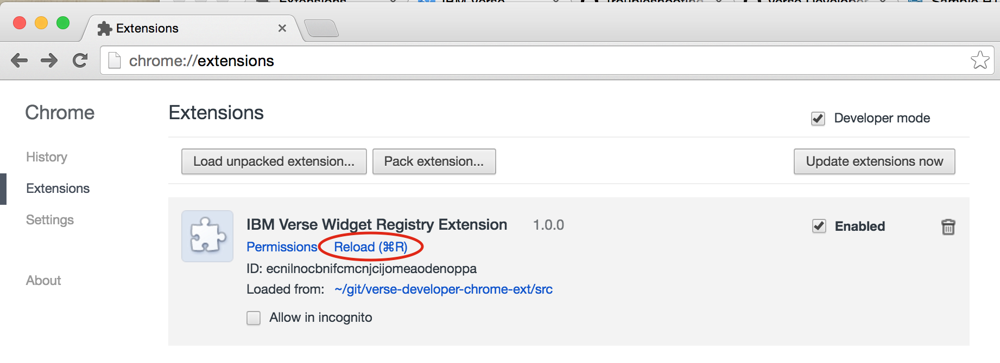

# IBM Verse Developer Extension for Google Chrome

IBM Verse Developer Extension for Google Chrome is an extension which is used in the development of widgets for IBM. It allows you to register your widget in IBM Verse as you develop it. Widgets registered with the extension are only available in the developers' local Chrome browser, and cannot be accessed from other devices.

## What's Here
- How to get started with the chrome extension
- How to register a widget


## Getting Started with the Chrome Extension
- Follow the documentation [Installing the Verse Developer Extension for Google Chrome][7] to install the extension.
- The extension contains the definition of some sample widgets, follow the instructions in the [documentation][1] to set up the samples. There are currently three samples provided:
  * [Add an action contribution to the business card view][2]
  * [Add an action contribution to the mail compose view][3]
  * [Add an action contribution to the mail read view][4]

## How to Register a Widget
The project contains a manifest file `src\widget.json` (copied below). This file contains a sample widget registration for the person action. It will add an action button at the back of the bizCard.


```
[
  {
    "app_id": "<unique id for this widget>",
    "name": "Person Sample",
    "url": "<URL to the web page which is displayed when this action is triggered>",

    "extensions": [
      {
        "type": "com.ibm.verse.action",
        "ext_id": "com.ibm.verselabs.action.sample.person",
        "name": "Person Action Sample",
        "payload": {},
        "object": "person",
        "title": "Person Action"
      }
    ],

    "payload": {
      "features": [
        "core"
      ],
      "preferences": [
        {
          "name": "searchFor",
          "value": "profile.primaryEmail"
        }
      ],
      "renderParams": {
        "width": "900",
        "height": "500"
      }
    },

    "services": [
      "Verse"
    ]
  }
]
```
You need to change the value of the `url` property to point to your web application. We have provided you with a [sample HTML][5] in the [documentation][1] for you to try out.

The `widget.json` can contain the definition of multiple widgets. For a list of properties contained in each widget. See [Working with the manifest file][6] section in our [documentation][1].

After you have made changes to any of the source code under the `/src` folder, it is necessary to `reload` the extension in the `chrome://extensions` tab, then reload Verse for the changes to be picked up.


To learn more about IBM Verse Developer Extension for Google Chrome, check out the [documentation][1].

*Source for documentation is available in the `gh-pages` branch of this repository*

The Verse Developer Extension for Google Chrome is © 2016 under the terms of the MIT License.

[1]: https://git.swg.usma.ibm.com/pages/IBM-Verse/verse-developer-chrome-ext/
[2]: https://git.swg.usma.ibm.com/pages/IBM-Verse/verse-developer-chrome-ext/tutorials/business_card.html
[3]: https://git.swg.usma.ibm.com/pages/IBM-Verse/verse-developer-chrome-ext/tutorials/mail.compose.html
[4]: https://git.swg.usma.ibm.com/pages/IBM-Verse/verse-developer-chrome-ext/tutorials/mail.read.html
[5]: https://git.swg.usma.ibm.com/pages/IBM-Verse/verse-developer-chrome-ext/tutorials/sample-html.html
[6]: https://git.swg.usma.ibm.com/pages/IBM-Verse/verse-developer-chrome-ext/tutorials/ext-manifest.html
[7]: https://git.swg.usma.ibm.com/pages/IBM-Verse/verse-developer-chrome-ext/tutorials/ext-install-toolkit.html
