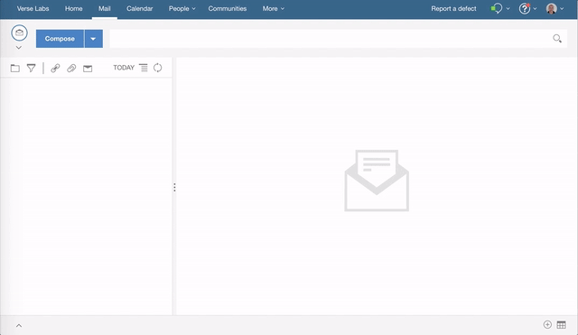

## {{page.title}}

This tutorial will get you started writing a hook before send extension for Verse.

Structure of the Tutorial:

1. [Add Hook Before Send Extension](#add-hook-before-send-extension)
2. [Secure the Application](#secure-the-application)

There is much more detailed documentation available [here](../developers), but it's not required to complete the tutorial.

This is a follow on tutorial to [Your First Application for IBM Verse](../developers/#how-to-install)

---

### Add Hook Before Send Extension

&nbsp;
&nbsp;

#### Edit applications.json
__1.__ Open `src/applications.json` in your text editor.

__2.__ Append the following object into the array in `applications.json`, and save the file. __Don't forget to add a comma `,` at the end of the preceding application before adding your own__.

```json
  {
    "id": "com.ibm.verse.app.beforeOnSend",
    "name": "Hook Before Send",
    "title": "Hook Before Send Sample",
    "description": "Sample that shows how to check for a secret value in mail being sent",
    "extensions": [
      {
        "type": "com.ibm.verse.ext.beforeOnSend",
        "ext_id": "com.ibm.verse.ext.hookbeforesend.sample",
        "name": "Hook Before Send Extension",
        "title": "Secret Value Checker",
        "payload": {
          "url": "${extensionPath}/hook-before-send/index.html"
        }
      }
    ],
    "services": [
      "Verse"
    ]
  }
```

__3.__ __Every time__ you make a change to the extension code, you need to __reload the extension__ first, then __reload Verse,__ so that the browser and Verse will pick up your latest changes.

For instructions on how to reload the extension click [here](../developers/#installing-to-chrome).

&nbsp;
&nbsp;

#### Test it out
1. In the Verse UI, click the __Compose__ button.
2. In the Mail Compose view, enter recipient and subject.
3. Enter the text 'Secret12345' in the mail body.
4. Click the send button and you will receive a warning about sending a mail containing the 'Secret12345'.
5. The user can go back and edit the mail before sending or can continue to send the mail as is.



Congratulations! You successfully registered the hook before send extension with Verse.

&nbsp;
&nbsp;

#### How it works

* This step introduces a new extension point with the type `com.ibm.verse.ext.beforeOnSend`
* The hook before send extension is added to the mail compose and is invoked when the user clients the send button
* The associated web application is loaded into an embedded iframe which displays in the mail compose view
* Verse sends a context message to the extension with the details of the mail being sent
* The extension can optionally send a message to Verse to signal that it should continue sending the mail message
* Otherwise the extension can display some data relevant to the mail message being sent


Below is the snippet of JavaScript which sends a message to Verse to signal that the mail should be sent:

```
  var response_message = {
    verseApiType: 'com.ibm.verse.message.continue.send'
  };
  event.source.postMessage(response_message, event.origin);
```

---

&nbsp;
&nbsp;

#### 2. Secure the Application

Follow the instructions to [secure the application](../developers/#secure-the-application).