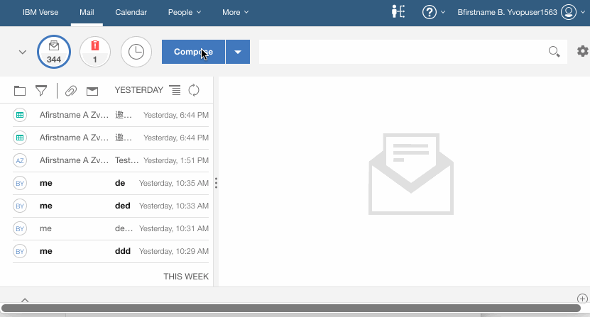

## {{page.title}}

This tutorial will get you started creating a directory search extension for Verse. This is a follow-on tutorial to [Your First Application for IBM Verse](../developers/#how-to-install)

There is much more detailed documentation available [here](../developers), but it's not required for completing the tutorial.

---

### Create Directory Search Extension

&nbsp;
&nbsp;

#### Edit applications.json
__1.__ Open `src/applications.json` in your text editor.

__2.__ Append the following object into the array in `applications.json`, and save the file. __Be sure to add a comma `,` at the end of the last object in applications.json before adding your own__. This tutorial takes `src/custom-directory-search/` as a sample which you can change to provide your own sample data.

```json
  {
    "name": "Directory Search Sample",
    "title": "Directory Search Sample",
    "description": "This is a sample of directory search extension",
    "extensions": [
      {
        "type": "com.ibm.verse.ext.directorySearch",
        "payload": {
          "url": "${extensionPath}/custom-directory-search/index.html",
          "enableBuiltinDirectorySearch": true
        }
      }
    ],
    "services": ["Verse"]
  }
```

__3.__ __Every time__ you change the extension code, __reload the extension__ then __reload Verse,__ so that the browser and Verse will pick up your latest changes.

For instructions on how to reload the extension click [here](../developers/#installing-to-chrome).

&nbsp;
&nbsp;

#### Test it out

The directory search extension will be invoked by clicking "Search Directory" button.

Here's an example of finding people when composing a new message:

1. Login Verse, click the **Compose** button.
2. In the New Message Dialog, type "sample hcl" in To field.
3. Click the **Search Directory** button, then Verse will do custom directory search and show results, like "User Sample 1" and so on.
4. Then you can pick someone you need.



Congratulations! You successfully configured a directory search extension with Verse.

&nbsp;
&nbsp;

#### How it works

* This step introduces a new extension point with the type `com.ibm.verse.ext.directorySearch`.
* A directory search extension is configured into Verse, and can be invoked by clicking 'Search Directory' button.
* When user types some characters and clicks 'Search Directory' button, Verse sends a message to the extension containing context data which includes the text to search.
* Once the directory search extension finishes the searching, it returns a message with the results to Verse.
* Once Verse receives the message with the result, it processes the result and shows them in search panel.

---

#### Secure the Application

Follow the instructions to [secure the application](../developers/#secure-the-application).
