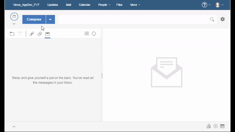

# {{page.title}}

This tutorial will get you started writing a live text extension with simple(new) specification extension for Verse.

Structure of the Tutorial:

1. [Create Live Text Extension](#create-live-text-extension)
2. [Secure the Application](#secure-the-application)

There is much more detailed documentation available [here][16], but it's not required to complete the tutorial.

This is a follow on tutorial to [Your First Application for IBM Verse][7]
(tutorial_verse_developer.html)

---

## 1. Create Live Text Extension

### Edit applications.json
__1.__ Open `src/applications.json` in your text editor.

__2.__ Append the following object into the array in `applications.json`, and save the file. __Don't forget to add a comma `,` at the end of the preceding application before adding your own__.

```json
  {
    "name": "A Live Text Sample",
    "title": "com.ibm.verse.livetext.widget.sample.45371992",
    "description": "The sample that shows how to config a live text in Verse",
    "extensions": [
      {
        "type": "com.ibm.verse.ext.liveText",
        "payload": {
          "text": "A Live Text Sample",
          "href": "https://pages.github.ibm.com/IBM-Verse/verse-developer-chrome-ext/reference/reference.html?tel=${1}&domain=${2}",
          "recognizer": "Tel:([0-9]{8}).*, ([A-Z]{2})",
          "location": "window"
        }
      }
    ],
    "payload": {},
    "services": [
      "Verse"
    ]
  }
```

__3.__ __Every time__ you make a change to the extension code, you need to __reload the extension__ first, then __reload Verse,__ so that the browser and Verse will pick up your latest changes.

For instructions on how to reload the extension click [here](https://github.ibm.com/pages/IBM-Verse/verse-developer-chrome-ext/tutorials/tutorial_verse_developer.html#installing-the-verse-developer-browser-extension).


__4.__ Enable Live Text in Verse  
To enable the Live Text feature in Verse, you have the following two different ways,  

  __(A)__ Experiment setting  
      Enable Verse extension  
      Enable live text (must enable Verse extension first)  

  __(B)__ URL parameters setting  
      `extension=1&livetext=1`  

### Test it out
1. In the Verse UI, click the __Compose__ button.
2. In the Mail Compose view, type in __Tel:82451234 Ring or Diamond, CN__ in the mail body.
3. Send the mail to yourself.
4. After you received the mail, open it in mail read view.
5. You will see that the text __Tel:82451234 Ring or Diamond, CN__ is recognized and underlined with dash line.
6. Click on the highlighed text, a menu will pop up with a menu item, __A Live Text Sample__.
7. Click on the menu item, __A Live Text Sample__, a new browser window will be opened with "__tel=82451234&domain=CN__" at the end of the URL.



Congratulations! You successfully configured a Live Text extension with Verse.

### How it works

* This step introduces a new extension point with the type `com.ibm.verse.ext.liveText`
* A live text extension is configured into Verse, the recognized live text will be highlighted to indicate the end user to click on it and then the menu item 
* Click on the popped up menu item, the specified web application is opened in a new window
* The web application receives parameters from the URL


---

## 2. Secure the Application

Follow the instructions to [secure the application](./tutorial_verse_developer.html#secure-the-application).

---

## Further Reading
1. [Introduction to Verse extensibility][3]{:target="_blank"}
2. [Editing the `manifest.json` file][4]{:target="_blank"}
3. [Working with match patterns in `manifest.json`][2]{:target="_blank"}
4. [Verse API data][5]{:target="_blank"}
5. [Sending and receiving data from Verse][6]{:target="_blank"}
6. [Registering an application in IBM Verse][9]{:target="_blank"}
7. [Introduction to cross-document messaging][11]{:target="_blank"}
8. [Security implementation against cross-site scripting attack][12]{:target="_blank"}
9. [Tips for debugging][14]{:target="_blank"}


[1]: https://chrome.google.com/webstore/detail/web-server-for-chrome/ofhbbkphhbklhfoeikjpcbhemlocgigb
[2]: https://developer.chrome.com/extensions/match_patterns
[3]: https://github.ibm.com/pages/IBM-Verse/verse-developer-chrome-ext/reference/reference.html#introduction-to-ibm-verse-extensibility
[4]: https://github.ibm.com/pages/IBM-Verse/verse-developer-chrome-ext/reference/reference.html#editing-the-manifest
[5]: https://github.ibm.com/pages/IBM-Verse/verse-developer-chrome-ext/reference/reference.html#verse-api-data
[6]: https://github.ibm.com/pages/IBM-Verse/verse-developer-chrome-ext/reference/reference.html#sending-and-receiving-data
[7]: https://github.ibm.com/pages/IBM-Verse/verse-developer-chrome-ext/tutorials/tutorial_verse_developer.html
[9]: https://github.ibm.com/pages/IBM-Verse/verse-developer-chrome-ext/reference/reference.html#registering-an-application-in-ibm-verse
[11]: https://developer.mozilla.org/en-US/docs/Web/API/Window/postMessage
[12]: https://github.ibm.com/pages/IBM-Verse/verse-developer-chrome-ext/reference/reference.html#security
[14]: https://github.ibm.com/pages/IBM-Verse/verse-developer-chrome-ext/reference/reference.html#troubleshooting
[16]: https://github.ibm.com/pages/IBM-Verse/verse-developer-chrome-ext/reference/reference.html
[17]:{{site.verse-developer-chrome-ext}}/blob/master/src/samples/templatedLink.js


