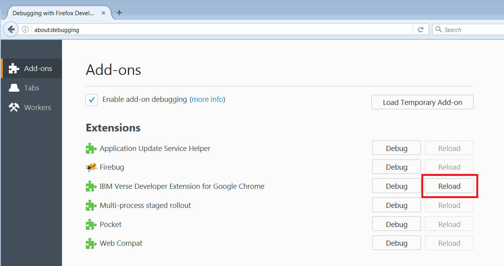
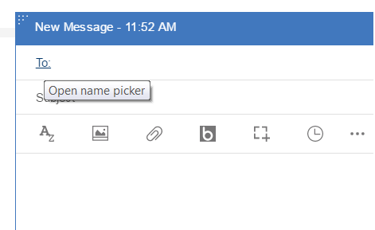
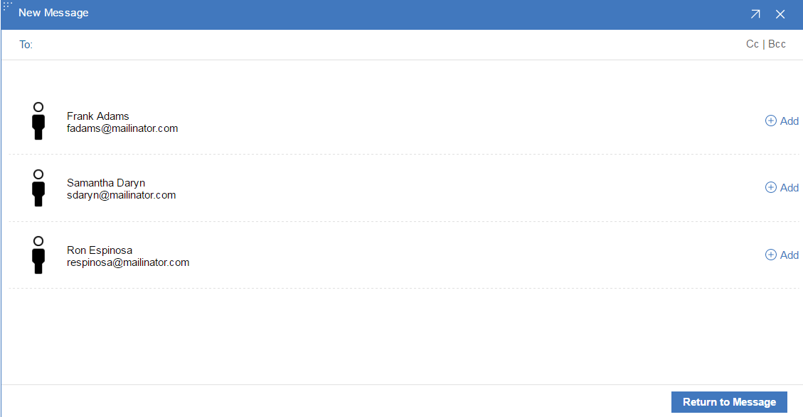

# {{page.title}}

This tutorial will get you started writing a custom name picker application for Verse.

There is much more detailed documentation available [here][1], but it's not required to complete the tutorial.

This is a follow on tutorial to [Your First Application for IBM Verse](tutorial_verse_developer.md)

---

## Add Action for Custom Name Picker

### Edit applications.json
__1.__ Open `src/applications.json` in your text editor.

__2.__ Append the following object into the array in `applications.json`, and save the file. __Don't forget to add a comma `,` at the end of the preceding application before adding your own__.

```json
{
  "id": "com.ibm.verse.custom.name.picker",
  "name": "Custom name picker",
  "title": "Name Picker",
  "description": "Custom name picker on mail compose",
  "extensions": [
    {
      "type": "com.ibm.verse.ext.namePicker",
      "ext_id": "com.ibm.verse.namepicker.sample.compose",
      "name": "Custom name picker in mail compose",
      "title": "Add Contact",
      "payload": {
        "url": "${extensionPath}/custom-name-picker/index.html"
      }
    }
  ],
  "payload": {},
  "services": [
    "Verse"
  ]
}

```

__3.__ Finally we require a small change in the verse developer manifest file.

In the __web_accessible_resources__ array add a new entry and call it __"custom-name-picker/index.html"__.


### Reload the extension and Verse
__Every time__ you make a change to the extension code, you need to __reload the extension__ first, then __reload Verse,__ so that Chrome and Verse will pick up your latest changes.

To reload the extension in Chrome, open your Chrome browser, go to `chrome://extensions`, find the IBM Verse Developer Extension for Google Chrome, and click __Reload__.  


To reload the extension in Firefox, open your Firefox browser, go to `about:debugging`, find the IBM Verse Developer Extension for Google Chrome, and click __Reload__.  



### Test it out
1. In the Verse UI, click the __Compose__ button.  


2. In the Mail Compose view, click on the __To__ link text.


3. From here you can pick someone to send the mail to.


Congratulations! You successfully registered the custom name picker with Verse.

---

[1]:../reference/reference.html
[2]:../samples/custom-name-picker
