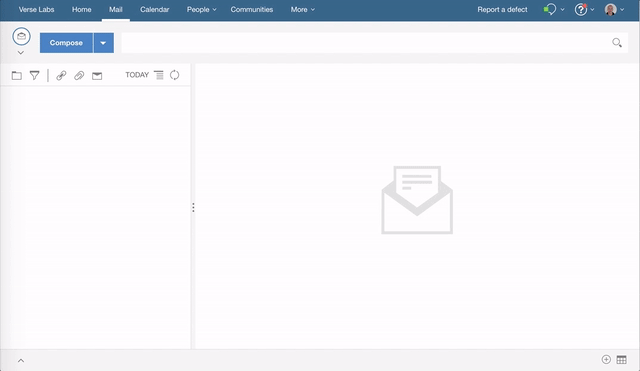

# {{page.title}}

This tutorial will get you started writing a hook before send extension for Verse.

Structure of the Tutorial:

1. [Add Hook Before Send extension](#1-add-hook-before-send-extension)
2. [Disable send button by default](#2-disable-send-button-by-default)
3. [Secure the Application](#3-secure-the-application)

There is much more detailed documentation available [here][16], but it's not required to complete the tutorial.

This is a follow on tutorial to [Your First Application for IBM Verse](tutorial_verse_developer.html)

---

## 1. Add Hook Before Send Extension

### Edit applications.json
__1.__ Open `src/applications.json` in your text editor.

__2.__ Append the following object into the array in `applications.json`, and save the file. __Don't forget to add a comma `,` at the end of the preceding application before adding your own__.

```json
  {
    "id": "com.ibm.verse.app.beforeOnSend",
    "name": "Hook Before Send Sample",
    "title": "Hook Before Send Sample",
    "description": "Sample that shows how to check for a credit card number in mail being sent",
    "extensions": [
      {
        "type": "com.ibm.verse.ext.beforeOnSend",
        "ext_id": "com.ibm.verse.ext.hookbeforesend.sample",
        "name": "Hook Before Send Extension",
        "title": "Hook Before Send Extension",
        "payload": {
          "url": "${extensionPath}/hook-before-send/index.html"
        }
      }
    ],
    "services": [
      "Verse"
    ]
  }
```

__3.__ __Every time__ you make a change to the extension code, you need to __reload the extension__ first, then __reload Verse,__ so that the browser and Verse will pick up your latest changes.

For instructions on how to reload the extension click [here](./tutorial_verse_developer.html#2-installing-the-verse-developer-browser-extension).


### Test it out
1. In the Verse UI, click the __Compose__ button.
2. In the Mail Compose view, enter recipient and subject.
3. Enter a test credit card number (e.g. 5105105105105100) in the mail body.
4. Click the send button and you will receive a warning about sending a mail containing a credit card number.
5. The user can go back and edit the mail before sending or can continue to send the mail as is.



Congratulations! You successfully registered the hook before send extension with Verse.

### How it works

* This step introduces a new extension point with the type `com.ibm.verse.ext.beforeOnSend`
* The hook before send extension is added to the mail compose and is invoked when the user clients the send button
* The associated web application is loaded into an embedded iframe which displays in the mail compose view
* Verse sends a context message to the extension with the details of the mail being sent
* The extension can optionally send a message to Verse to signal that it should continue sending the mail message
* Otherwise the extension can display some data relevant to the mail message being sent


Below is the snippet of JavaScript which sends a message to Verse to signal that the mail should be sent:

```
  var response_message = {
    verseApiType: 'com.ibm.verse.message.continue.send'
  };
  event.source.postMessage(response_message, event.origin);
```

---

## 2. Disable send button by default

### Edit applications.json
__1.__ Open `src/applications.json` in your text editor.

__2.__ Replace the object you added in step #2 with the one below, and save the file.

```json
  {
    "id": "com.ibm.verse.app.beforeOnSend",
    "name": "Hook Before Send Sample",
    "title": "Hook Before Send Sample",
    "description": "Sample that shows how to check for a credit card number in mail being sent",
    "extensions": [
      {
        "type": "com.ibm.verse.ext.beforeOnSend",
        "ext_id": "com.ibm.verse.ext.hookbeforesend.sample",
        "name": "Hook Before Send Extension",
        "title": "Hook Before Send Extension",
        "payload": {
          "url": "${extensionPath}/hook-before-send-disable/index.html",
          "disableSend": true
        }
      }
    ],
    "services": [
      "Verse"
    ]
  }
```

__3.__ Reload the extension and reload Verse.


### Test it out
1. In the Verse UI, click the __Compose__ button.
2. In the Mail Compose view, enter recipient and subject.
3. Enter a test credit card number (e.g. 5105105105105100) in the mail body.
4. Click the send button and you will receive a warning about sending a mail containing a credit card number.
5. This time the user cannot click the send button to send the mail as is.


### How it works

* This step introduces a new property supported by the `com.ibm.verse.ext.beforeOnSend` extension point
* Adding `"disableSend": true` to the payload will cause the send button to be disabled by default
* The extension can optionally send a message to Verse to signal that it should re-enable the send button
* Otherwise the user will have to return to the message and adjust the mail before they can send it


Below is the snippet of JavaScript which sends a message to Verse to signal that the send button should be enabled:

```
  var response_message = {
    verseApiType: 'com.ibm.verse.message.enable.send'
  };
  event.source.postMessage(response_message, event.origin);
```

---

## 3. Secure the Application

Follow the instructions to [secure the application](./tutorial_verse_developer.html#5-secure-the-application).

---

## Further Reading
1. [Introduction to Verse extensibility][3]{:target="_blank"}
2. [Editing the `manifest.json` file][4]{:target="_blank"}
3. [Working with match patterns in `manifest.json`][2]{:target="_blank"}
4. [Verse API data][5]{:target="_blank"}
5. [Sending and receiving data from Verse][6]{:target="_blank"}
6. [Registering an application in IBM Verse][9]{:target="_blank"}
7. [Introduction to cross-document messaging][11]{:target="_blank"}
8. [Security implementation against cross-site scripting attack][12]{:target="_blank"}
9. [Tips for debugging][14]{:target="_blank"}


[1]: https://chrome.google.com/webstore/detail/web-server-for-chrome/ofhbbkphhbklhfoeikjpcbhemlocgigb
[2]: https://developer.chrome.com/extensions/match_patterns
[3]: ../reference/reference.html#introduction-to-ibm-verse-extensibility
[4]: ../reference/reference.html#editing-the-manifest
[5]: ../reference/reference.html#verse-api-data
[6]: ../reference/reference.html#sending-and-receiving-data
[7]: {{site.verse-developer-chrome-ext}}
[8]: {{site.verse-developer-chrome-ext}}/archive/master.zip
[9]: ../reference/reference.html#registering-an-application-in-ibm-verse
[11]: https://developer.mozilla.org/en-US/docs/Web/API/Window/postMessage
[12]: ../reference/reference.html#security
[14]:../reference/reference.html#troubleshooting
[15]:{{site.verse-developer-chrome-ext}}/blob/master/src/samples/templatedLink.html
[16]:../reference/reference.html
[17]:{{site.verse-developer-chrome-ext}}/blob/master/src/samples/templatedLink.js


