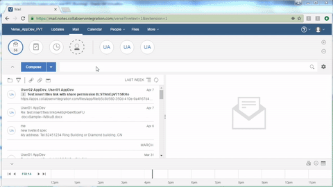

# {{page.title}}

This tutorial will get you started creating a live text extension for Verse. This is a follow-on tutorial to [Your First Application for IBM Verse][7](tutorial_verse_developer.html)

There is much more detailed documentation available [here][8], but it's not required for completing the tutorial.


---

## Create Live Text Extension

### Edit applications.json  
__1.__ Open `src/applications.json` in your text editor.

__2.__ Append the following object into the array in `applications.json`, and save the file. __Don't forget to add a comma (`,`) at the end of the preceding application before adding your own__.

```json
  {
    "name": "Live Text Widget Sample application",
    "title": "Live Text Widget Sample",
    "description": "The sample shows how to contribute a live text extension in Verse",
    "extensions": [
      {
        "name": "Live Text Widget Sample extension",
        "ext_id": "com.ibm.verse.livetext.sample",
        "type": "com.ibm.verse.ext.liveText",
        "payload": {
          "text": "Live Text Widget Action",
          "href": "${extensionPath}/${1}/sample1.html?tel=${2}",
          "recognizer": "Path:([a-z].*), Tel:([0-9]{8}).*",
          "location": "window",
          "renderParams": {
            "width": "800",
            "height": "600"
          }
        }
      }
    ],
    "payload": {},
    "services": [
      "Verse"
    ]
  }
```

__3.__ __Every time__ you make a change to the extension code, you need to __reload the extension__ first, then __reload Verse,__ so that the browser and Verse will pick up your latest changes.

For instructions on how to reload the extension click [here](tutorial_verse_developer.html#2-installing-the-verse-developer-browser-extension).


### Test it out
1. In the Verse UI, click the __Compose__ button.
2. In the New Mail Dialog, type in __Path:live-text, Tel:82451234 CN__ in the mail body.
3. Send the mail to yourself.
4. When you receive the mail, open it.
5. You will see that the text __Path:live-text, Tel:82451234 CN__ is recognized and underlined.
6. Click on the underlined text, a menu will pop up with a menu item, __Live Text Widget Action__.

7. Click on the menu item, __Live Text Widget Action__, a new browser window will be opened with "__live-text__/sample1.html?tel=__82451234__" at the end of the URL.



Congratulations! You successfully configured a Live Text extension with Verse.

### Multiple Actions  
Sometimes you might want to create multiple actions for one live text. 

To do this, create multiple Live Text extensions with a 
recognizer property to recognize the same live text. The multiple action items 
will be organized into one pop-up menu for the recognized live text.  

You can follow the steps above to add the following object into the array in `applications.json`, and test the multiple actions.  

```json
[
  {
    "name": "Live Text Widget Multiple Actions Sample",
    "title": "The Live Text Widget Sample with Multiple Actions",
    "description": "The sample shows how to create multiple Live Text actions for the same Live Text in Verse",
    "extensions": [
      {
        "name": "Live Text Widget Action Sample One",
        "ext_id": "com.ibm.verse.livetext.sample.one",
        "type": "com.ibm.verse.ext.liveText",
        "payload": {
          "text": "Live Text Widget Action One",
          "href": "${extensionPath}/${1}/sample1.html?tel=${2}",
          "recognizer": "Path:(live-text), Tel:([0-9]{8}).*",
          "location": "window",
          "renderParams": {
            "width": "800",
            "height": "400"
          }
        }
      },
      
      {
        "name": "Live Text Widget Action Sample Two",
        "ext_id": "com.ibm.verse.livetext.sample.two",
        "type": "com.ibm.verse.ext.liveText",
        "payload": {
          "text": "Live Text Widget Action Two",
          "href": "${extensionPath}/live-text/sample2.html?tel=${2}",
          "recognizer": "Path:(live-text), Tel:([0-9]{8}).*",
          "location": "tab"
        }
      }
    ],
    "payload": {},
    "services": [
      "Verse"
    ]
  }
]
```

### How it works

1. This step introduces a new extension point with the type `com.ibm.verse.ext.liveText`
1. A live text extension is configured into Verse, the recognized live text will be underlined
1. Click on the underlined text to display the pop-up menu
1. Click on an item in the pop-up menu and the specified web application is opened in a new window or a new tab
1. The web application receives parameters from the URL


---

## Further Reading
1. [Introduction to Verse extensibility][1]{:target="_blank"}
2. [Editing the `manifest.json` file][2]{:target="_blank"}
3. [Working with match patterns in `manifest.json`][3]{:target="_blank"}
4. [Verse API data][4]{:target="_blank"}
5. [Registering an application in IBM Verse][5]{:target="_blank"}
6. [Tips for debugging][6]{:target="_blank"}


[1]: ../reference/reference.html#introduction-to-ibm-verse-extensibility
[2]: ../reference/reference.html#editing-the-manifest
[3]: https://developer.chrome.com/extensions/match_patterns
[4]: ../reference/reference.html#verse-api-data
[5]: ../reference/reference.html#registering-an-application-in-ibm-verse
[6]: ../reference/reference.html#troubleshooting
[7]: tutorial_verse_developer.html
[8]: ../reference/reference.html
