# {{page.title}}

This tutorial will get you started writing an application for Verse. There is much more detailed documentation available [here][16]{:target="_blank"}, but it's not required to complete the tutorials.

Structure of the Tutorial:

1. [Introduction](#introduction)
2. [Installing the Verse Developer Extension for Google Chrome](#installing-the-verse-developer-extension-for-google-chrome)
3. [Add Action for Mail Compose](#add-action-for-mail-compose)
4. [Add Action for Mail Read](#add-action-for-mail-read)
5. [Create a New Application Implementation](#create-a-new-application-implementation)

---

## 1. Introduction

### What is the Verse Developer Extension for Google Chrome?

The Verse Developer Extension for Google Chrome is a tool for developers who are adding customised capabilities to IBM Verse. The tool allows an application to be registered with IBM Verse, where each application contains a set of customised capabilities. One or more applications can be registered using the tool. Each application can contain one or more extensions. IBM Verse supports 3 types of extensions:

1. Simple Link (type = com.ibm.appreg.ext.simpleLink)
2. Templated Link (type = com.ibm.appreg.ext.templatedLink)
3. Widget (type = com.ibm.verse.ext.widget)
  * Each Widget can contribute one or more actions to the Verse UI

 which are displayed in IBM Verse as either a button or a link. Extensions can be contributed to the following parts of the IBM Verse user interface (surrounded by a red border in the pictures):

* Business Card (bizCard) View

  access via __i__ icon on people bubble:

  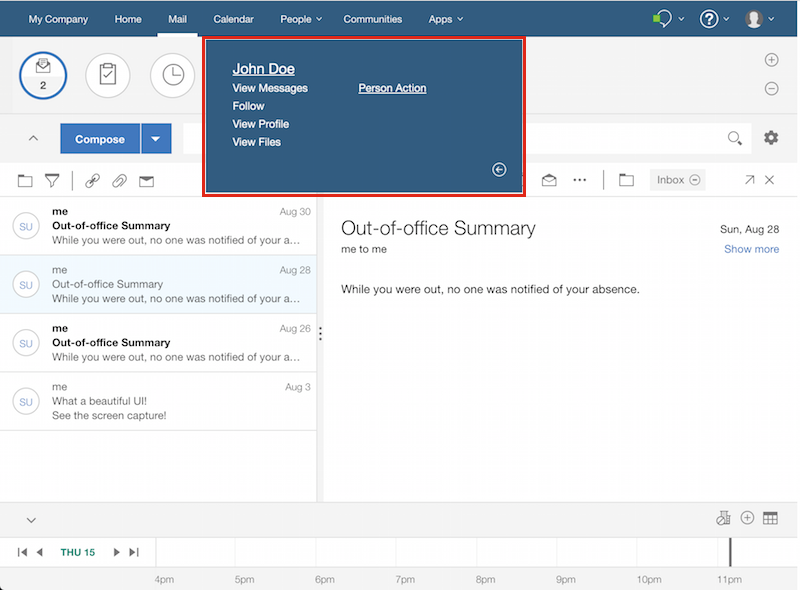

  access via hover, wait, then click on sender in message list:

  

  access via hover, wait, then click on sender in mail preview panel:

  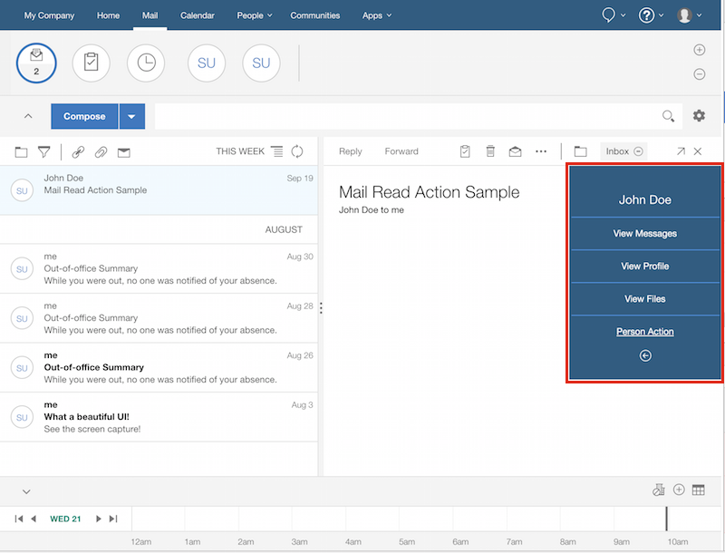

* Mail Compose View

  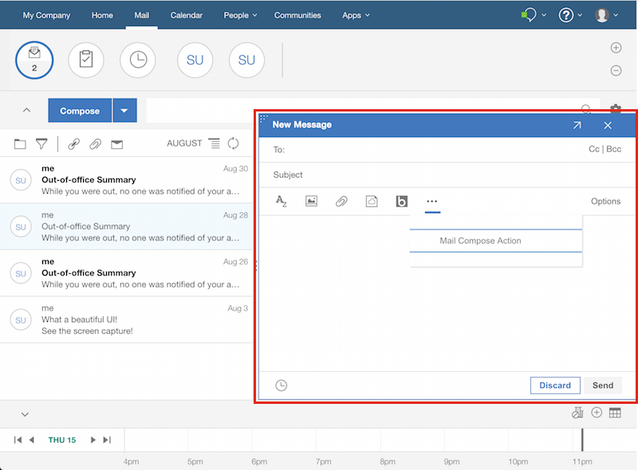

* Mail Read View

  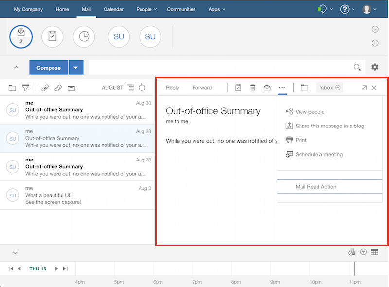

### What you are going to build
This tutorial starts with a sample application for you to add functionality to the Business Card (bizCard) in Verse. Then you will write another application that adds functionality to both the Mail Compose and Mail Read views.

### What you'll learn
* How to add extensions into the Verse UI for your application.
* How to transfer data from Verse to your application.

### What you'll need
* Google Chrome browser
* [Web Server for Chrome][1]{:target="_blank"} (alternatively, you can also use FireFox Thimble, or your own web server of choice)
* The Verse Developer Chrome Extension source code
* A text editor
* Basic knowledge of HTML, CSS, JavaScript, and Chrome DevTools
* Estimated time: 40 min

This tutorial gets you started on building an application for Verse. It does not go into the details of the API and different concepts. If you want to learn more, you can refer to the [Further Reading](#further-reading) section at the end of the tutorial, but the readings are not required to finish this tutorial.

Note: The changes you make during the tutorial will only be applied to the Chrome browser that has the extension installed. To let other people test your Application, you will need to share the edited extension with them and let them install it on their Chrome browsers too. IBM will be providing an Application Registry to allow you to deploy your application in production.

---

## 2. Installing the Verse Developer Extension for Google Chrome
In this section, you will install the default Verse Developer Extension and make it work with Verse. This Verse Developer Extension already has one sample application, which contains one extension.

### Download source code for Verse Developer Extension
1. Download the Verse Developer Extension for Google Chrome source code to your local file system by clicking [here][8].

  Alternatively, you can fork the repository from [here][7]{:target="_blank"} instead of downloading it.

2. Extract the folder at a location convenient to you.

3. After you have extracted the folder, locate the `src` folder. In this tutorial, you will modify the `manifest.json` and `applications.json` files from within the `src` folder.

We have also provided a `tutorial` folder which contains four subfolders: `step2`, `step3`, `step4`, and `step5`. Each subfolder includes the completed version of the files modified in each step of the tutorial.

### Update manifest.json
In the `src/manifest.json` file there is a `matches` property, which contains an array of URLs. The extension will only run if the URL visited by the user matches one of the URLs listed in this array. If the Verse URL you are using is not listed in this array, update the `manifest.json` file to include it:

1. Open `src/manifest.json` file in a text editor.

2. See if the value for the property `matches` contains the URL you will be using for Verse. The `*` at the end of a URL means matching 0 or more characters. We recommend adding the `*`.

3. If your Verse URL is already there, skip to the next step [Load unpacked extension](#load-unpacked-extensions). Otherwise, append the Verse URL you will be working with into the array as a string. __Don't forget to add a comma `,` at the end of the preceding URL before adding your own__.

    For example:  
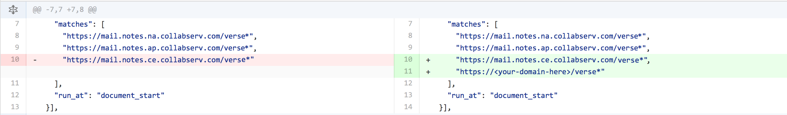


### Load unpacked extensions
1. Open your Google Chrome browser, and type in the address bar: `chrome://extensions`.

2. Select __Developer mode__, (unpacked extensions can only be loaded in __Developer mode__.)  


3. Click the button __Load unpacked extension...__.  


4. In the pop-up file picker, select the `src` folder, which contains the `manifest.json` file.  


5. At this point, you should be able to see the IBM Verse Developer Extension for Google Chrome loaded into your `chrome://extensions` page.  


  If you received an error related to `Failed to load extension from: ... Manifest file is missing or unreadable`, make sure you are loading the extension from the `src` folder, not its parent folder.


### Reload Verse and test it out
1. __Reload Verse__, so that it will pick up the change you made to the extension.

2. Hover over a People bubble, and click on the __i__ icon to bring up the business card (bizCard).  
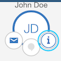

3. Click on the __arrow__ button located at the right bottom part of the bizCard to turn the bizCard around.  
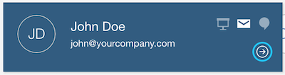

4. At the back of the bizCard you will see a new link called __Person Action__.  
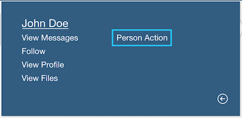

5. Click on the __Person Action__ link. This will load a web application (in a separate window) that uses information sent from the Verse bizCard.


### How it works
If you have reached this step, congratulations! You successfully installed the Verse Developer Extension with one default application. But how does this all work?

The external application is registered via the file `applications.json`, which is under the `src` folder. This file is also responsible for adding the __Person Action__ templated link to the bizCard.

Open `src/applications.json` in a text editor. It contains an array of objects. Each object contains an application, with one or more extensions registered under it. The URL for the external application is specified under the property `href`.

The URL contains the variable `profile.primaryEmail`, surrounded by a pair of curly brackets with a dollar sign `${}`. The value for this variable will be calculated and automatically filled in when the external application is loaded.

`profile.primaryEmail` is part of the *context* object for the bizCard that gets sent to the external application from Verse. A context object contains information related to Verse. Each of the extension points (bizCard, Mail Read view, and Mail Compose view), will have its own context structure.

To learn more about context objects and how they get sent, please refer to __Verse API data__ and __Sending and receiving data from Verse__ in the [Further Reading](#further-reading) section at the end of the tutorial.

For adding the UI link on the bizCard, we specified `com.ibm.appreg.object.person` as the value for the `object` property under `extensions`, and set its title to `"Person Action"` via the `title` property. In the next section, you will learn how to add UI buttons on different parts of the Verse UI.

---

## 3. Add Action for Mail Compose
In this section, you will add a new application, which consists of one extension, to Verse. The extension will add a widget to the Mail Compose View. When the user clicks on this widget, an external application will be opened in a separate window, and will print out the details of the event data sent from Verse. In the next section, you will add a second extension into this application.


### Edit applications.json
1. Open `src/applications.json` in your text editor.

2. Append the following object into the array in `applications.json`, and save the file. __Don't forget to add a comma `,` at the end of the preceding application before adding your own__.

```json
    {
      "app_id": "com.ibm.verse.sample.app.widget",
      "name": "Mail Sample",
      "title": "Mail Sample Title",
      "description": "Mail Sample Description",

      "extensions": [
      {
        "ext_id": "com.ibm.verse.sample.ext.widget.mail.compose",
        "name": "Mail Compose Action Sample",
        "type": "com.ibm.verse.ext.widget",
        "payload": {
          "url": "{{site.baseurl}}/samples/actions.html",
          "features": ["core"],
          "actions": [{
            "id": "com.ibm.verse.ext.mail.compose.action",
            "path": "mail.compose",
            "text": "Mail Compose Action",
            "title": "Mail Compose Action",
            "location": "window",
            "renderParams": {
              "width": "900",
              "height": "500"
            }
          }]
        }
      }],

      "services": [
        "Verse"
      ]
    }
```


Your file `applications.json` should now look like this:  

```json
  [
    {
      "app_id": "com.ibm.verse.sample.app.templatedlink",
      "name": "Person Sample",
      "title": "Templated Link Person Sample",
      "description": "This samples demonstrates using the Templated Link extension point with a Person object",

      "extensions": [
        {
          "ext_id": "com.ibm.verse.sample.ext.templatedlink",
          "name": "Person Templated Link",
          "type": "com.ibm.appreg.ext.templatedLink",
          "object": "com.ibm.appreg.object.person",
          "payload": {
            "text": "Person Templated Link",
            "title": "Person Action",
            "href": "https://git.swg.usma.ibm.com/pages/IBM-Verse/verse-developer-chrome-ext/samples/actions.html?searchFor=${profile.primaryEmail}"
          }
        }
      ],

      "services": [
        "Verse"
      ]
    },

    {
      "app_id": "com.ibm.verse.sample.app.widget",
      "name": "Mail Sample",
      "title": "Mail Sample Title",
      "description": "Mail Sample Description",

      "extensions": [
      {
        "ext_id": "com.ibm.verse.sample.ext.widget.mail.compose",
        "name": "Mail Compose Action Sample",
        "type": "com.ibm.verse.ext.widget",
        "payload": {
          "url": "https://git.swg.usma.ibm.com/pages/IBM-Verse/verse-developer-chrome-ext/samples/actions.html",
          "features": ["core"],
          "actions": [{
             "id": "com.ibm.verse.ext.mail.compose.action",
             "path": "mail.compose",
             "text": "Mail Compose Action",
             "title": "Mail Compose Action",
             "location": "window",
             "renderParams": {
                "width": "900",
                "height": "500"
             }
          }]
        }
      }],

      "services": [
        "Verse"
      ]
    }
  ]
```

### Reload the extension and Verse
__Every time__ you make a change to the extension code, you need to __reload the extension__ first, then __reload Verse,__ so that Chrome and Verse will pick up your latest changes.

To reload the extension, open your Chrome browser, go to `chrome://extensions`, find the IBM Verse Developer Extension for Google Chrome, and click __Reload__.  


### Test it out
1. In the Verse UI, click the __Compose__ button.  
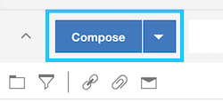

2. In the pop-up Mail Compose view, click on the __More actions__ button.  
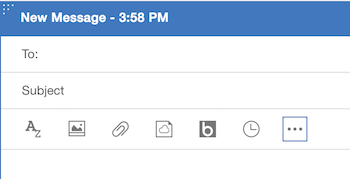

3. In the drop-down menu, click __Mail Compose Action__. This will bring up the web application you just registered with the Chrome extension, with information related to the Mail Compose view passed on from Verse.  
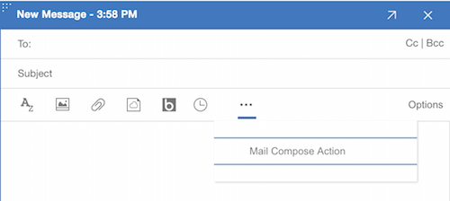

Congratulations! You successfully added a button to the Mail Compose view, and registered the relevant application with Verse.


### How it works
In this section, a new application with its own `app_id` is added into `applications.json` and thus registered with Verse. Under this new app, you will add an extension with its own `ext_id`. It is also possible to add multiple extensions within the same application. We will give you an example in the next section.

You might have noticed that some of the properties in the newly added application are quite different from the previous bizCard application.

Under `extensions`, instead of using `object: "com.ibm.appreg.object.person"`, our new application uses `path: "mail.compose"`. This indicates the action button should be located in the Mail Compose view. You might wonder, why would we use the key `object` in our previous example for bizCard, but `path` here for the Mail Compose view? The reason is, for this example, you are writing an extension for a particular UI view (Mail Compose view), while in the previous extension, instead of extending a particular UI view, you are actually extending the __Person__ object, which manifests in Verse as a bizCard, and you can open a bizCard from some other places apart from the People bubble.

The key `payload` appears within the extension definition, as a child of the `extensions` key.

Under `payload` at the extension level, we are using `"features": ["core"]` to ask Verse to send context structure related to the Mail Compose view to the external application via cross-document messaging.


---

## 4. Add Action for Mail Read
In this section, you will add a button to the Mail Read view that, when clicked, will open a separate window with information related to the Mail Read view sent from Verse. You will add this extension into the application that you created in the last section (which currently contains one extension for the Mail Compose view).


### Edit applications.json
1. Open `src/applications.json` in your text editor.

2. Append the following object into the `extensions` belonging to the application with `app_id`: `com.ibm.verse.sample.app.widget`, and save the file. __Don't forget to add a comma `,` at the end of the preceding Extension before adding your own__.


```json
    {
      "ext_id": "com.ibm.verse.sample.ext.widget.mail.read",
      "name": "Mail Read Action Sample",
      "type": "com.ibm.verse.ext.widget",
      "payload": {
        "url": "https://git.swg.usma.ibm.com/pages/IBM-Verse/verse-developer-chrome-ext/samples/actions.html",
        "features": ["core"],
        "actions": [{
          "id": "com.ibm.verse.ext.mail.read.action",
          "path": "mail.read",
          "text": "Mail Read Action",
          "title": "Mail Read Action",
          "location": "window",
          "renderParams": {
            "width": "900",
            "height": "500"
          }
        }]
      }
    }],
```

Your file `applications.json` should look something like this:  

```json
  [
    {
      "app_id": "com.ibm.verse.sample.app.templatedlink",
      "name": "Person Sample",
      "title": "Templated Link Person Sample",
      "description": "This samples demonstrates using the Templated Link extension point with a Person object",

      "extensions": [
        {
          "ext_id": "com.ibm.verse.sample.ext.templatedlink",
          "name": "Person Templated Link",
          "type": "com.ibm.appreg.ext.templatedLink",
          "object": "com.ibm.appreg.object.person",
          "payload": {
            "text": "Person Templated Link",
            "title": "Person Action",
            "href": "https://git.swg.usma.ibm.com/pages/IBM-Verse/verse-developer-chrome-ext/samples/actions.html?searchFor=${profile.primaryEmail}"
          }
        }
      ],

      "services": [
        "Verse"
      ]
    },

    {
      "app_id": "com.ibm.verse.sample.app.widget",
      "name": "Mail Sample",
      "title": "Mail Sample Title",
      "description": "Mail Sample Description",

      "extensions": [
      {
        "ext_id": "com.ibm.verse.sample.ext.widget.mail.compose",
        "name": "Mail Compose Action Sample",
        "type": "com.ibm.verse.ext.widget",
        "payload": {
          "url": "https://git.swg.usma.ibm.com/pages/IBM-Verse/verse-developer-chrome-ext/samples/actions.html",
          "features": ["core"],
          "actions": [{
             "id": "com.ibm.verse.ext.mail.compose.action",
             "path": "mail.compose",
             "text": "Mail Compose Action",
             "title": "Mail Compose Action",
             "location": "window",
             "renderParams": {
                "width": "900",
                "height": "500"
             }
          }]
        }
      },
      {
        "ext_id": "com.ibm.verse.sample.ext.widget.mail.read",
        "name": "Mail Read Action Sample",
        "type": "com.ibm.verse.ext.widget",
        "payload": {
          "url": "https://git.swg.usma.ibm.com/pages/IBM-Verse/verse-developer-chrome-ext/samples/actions.html",
          "features": ["core"],
          "actions": [{
            "id": "com.ibm.verse.ext.mail.read.action",
            "path": "mail.read",
            "text": "Mail Read Action",
            "title": "Mail Read Action",
            "location": "window",
            "renderParams": {
              "width": "900",
              "height": "500"
            }
          }]
        }
      }],

      "services": [
        "Verse"
      ]
    }
  ]
```

### Reload the extension and Verse
As explained in previous sections, __every time__ you make a change to the extension code, you need to __reload the extension__ from `chrome://extensions`, then __reload Verse,__ so that Chrome and Verse will pick up your latest changes.


### Test it out
1. In the Verse UI, click on a mail to open it in the Mail Read view.

2. In the Mail Read view, click on the __More actions__ button.  


3. In the drop-down menu, click __Mail Read Action__. This will bring up the web application you just registered with the Chrome extension, with information related to the Mail Read view passed on from Verse.  
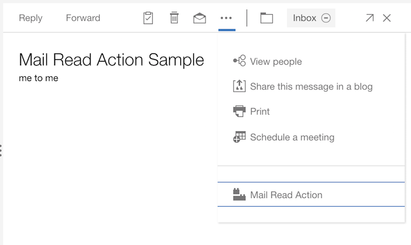

Congratulations! You successfully added an action button to the Mail Read view, and registered it as a new extension for the Mail Read application that you created in the last section.


### How it works
In the previous section, you learned how to add an application containing one extension to Verse by adding the new application definition into the `applications` array in `applications.json`. In this section, you learned how to add an additional extension into this application by adding the new extension into the `extensions` array.

The configuration differences between the new Mail Read extension and the Mail Compose extension previously added are slight. For example, in the Mail Read extension, the `path` property is set to `mail.read` rather than `mail.compose`. This indicates that the action button should be located in the Mail Read view.

---

## 5. Create a New Application Implementation
The previous sections showed you how to register an applications with Verse, add one or more extensions under each application, and add action buttons to the Verse UI.

To register these applications, you relied on a sample web page used in the `url` property element in `applications.json`. You will now implement your own web page.


### Create a web page
In this step you are going to create an HTML page, which will pop up when the user clicks on the action buttons previously added to Verse.

Create an empty folder on your laptop and create a file called `index.html` inside the folder.

Open `index.html` in a text editor, copy and paste our sample HTML code from [here][15]{:target="_blank"} into the file, and then save the file.

The web page shows details of the event sent from Verse to the application for each of the action buttons that you added. In the case of the bizCard extension, it will also print out the query arguments which were appended to the URL.

Please be aware that if you want to move this sample HTML code into a production environment there are certain security implementation you should add to protect it against cross-site scripting attack. See the [Further Reading](#further-reading) section for more details. __It is the responsibility of the extension developer to ensure data received is treated appropriately.__


### Set up a web server
You will need a place to host the web page you just created.

If you are familiar with setting up your own server for hosting web pages, or prefer to use some alternative solutions such as FireFox Thimble, feel free to skip to the next step [Edit applications.json to point to your new URL](#edit-applicationsjson-to-point-to-your-new-url).

Otherwise, you can use the Chrome Web Server to set up a localhost on your machine by following these steps:

1. Install the Chrome Web Server from the [Chrome Web Store][1]{:target="_blank"} using your Chrome browser.

2. After installing, launch it by navigating to `chrome://apps` in your Chrome browser, and clicking on the icon for the Chrome Web Server:  
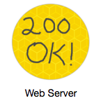

3. After the application is launched, click the __choose folder__ button and select the folder where you saved your `index.html` file.  
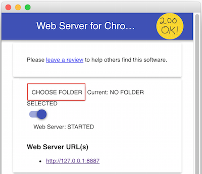

4. In the __options__ section, check the option "Automatically show index.html".  
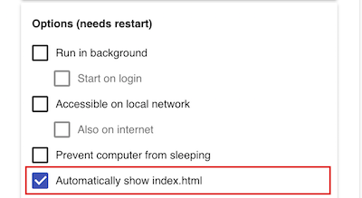  
This will allow you to use the Web Server URL shown in the section below without appending `/index.html` after the URL.

5. Toggle the __Web Server: STARTED__ button to stop, then restart the web server. Once the server is started (indicated by a blue color on the button), you can access index.html by clicking on the link provided under the __Web Server URL(s)__ section, or by typing that address into the browser.  
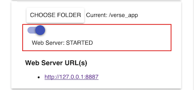

  The web page you created will open in a separate window. As you are not accessing the page via Verse, you won't see any Verse API data at this point.  


### Edit applications.json to point to your new URL
Open `applications.json` in a text editor. Change the value for the `href` properties in the Person Sample to the address where your `index.html` page is hosted, but leave the query strings of the first application in your URL. If you were following our tutorial to use the Web Server for Chrome app to set up the server, this will be the value provided by the application under the section __Web Server URL(s)__.

```json
{
  "app_id": "com.ibm.verse.sample.app.templatedlink",
  "name": "Person Sample",
  "title": "Templated Link Person Sample",
  "description": "This samples demonstrates using the Templated Link extension point with a Person object",

  "extensions": [
    {
      "ext_id": "com.ibm.verse.sample.ext.templatedlink",
      "name": "Person Templated Link",
      "type": "com.ibm.appreg.ext.templatedLink",
      "object": "com.ibm.appreg.object.person",
      "payload": {
        "text": "Person Templated Link",
        "title": "Person Action",
        "href": "http://127.0.0.1:8887?searchFor=${profile.primaryEmail}"
      }
    }
  ],

  "services": [
    "Verse"
  ]
},
```
Do the same for the `url` properties in the Mail Sample application.

```json
{
  "app_id": "com.ibm.verse.sample.app.widget",
  "name": "Mail Sample",
  "title": "Mail Sample Title",
  "description": "Mail Sample Description",

  "extensions": [
  {
    "ext_id": "com.ibm.verse.sample.ext.widget.mail.compose",
    "name": "Mail Compose Action Sample",
    "type": "com.ibm.verse.ext.widget",
    "payload": {
      "url": "http://127.0.0.1:8887",
      "features": ["core"],
      "actions": [{
         "id": "com.ibm.verse.ext.mail.compose.action",
         "path": "mail.compose",
         "text": "Mail Compose Action",
         "title": "Mail Compose Action",
         "location": "window",
         "renderParams": {
            "width": "900",
            "height": "500"
         }
      }]
    }
  },
  {
    "ext_id": "com.ibm.verse.sample.ext.widget.mail.read",
    "name": "Mail Read Action Sample",
    "type": "com.ibm.verse.ext.widget",
    "payload": {
      "url": "http://127.0.0.1:8887",
      "features": ["core"],
      "actions": [{
        "id": "com.ibm.verse.ext.mail.read.action",
        "path": "mail.read",
        "text": "Mail Read Action",
        "title": "Mail Read Action",
        "location": "window",
        "renderParams": {
          "width": "900",
          "height": "500"
        }
      }]
    }
  }],

  "services": [
    "Verse"
  ]
}
```


### Test it out
Now try it out in Verse: first __reload the extension and then reload Verse__ to pick up your latest code changes.

Try clicking the action buttons that you added into Verse in previous steps, including the __Person Action__ button at the back of the bizCard, the __Mail Compose Action__ button in the Mail Compose view, and the __Mail Read Action__ in the Mail Read view. These actions will bring up (in a separate window) the web page you added in the previous section. __The URL shown in the address bar should be the same URL you just added in the previous step.__ The web page should be populated with some Verse API data now as the web application is accessed via Verse.  
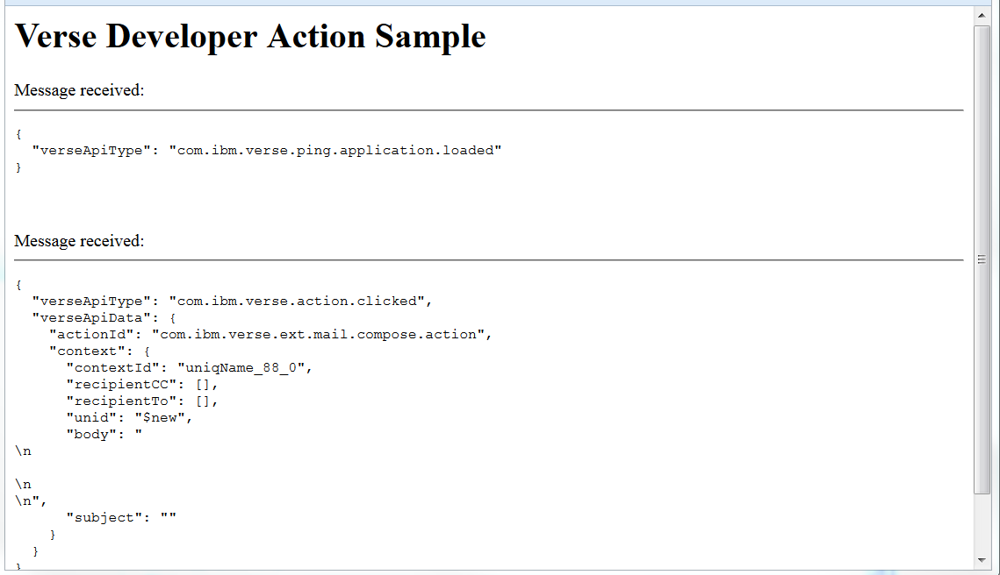


### How it works
When a user clicks on a new action button added to Verse via `applications.json`, Verse contacts your application at the URL specified in the file and opens it in a new window. Once your application is ready, Verse sends it the relevant data, which is then displayed in your application's window.

Now that you have learned how to register your application with Verse, add action buttons to the Verse UI, and get Verse to send data to your application, you can modify the sample HTML code we provided in the previous section [Create a web page](#create-a-web-page) to make your own application for Verse!


---

## Further Reading
1. [Introduction to Verse extensibility][3]{:target="_blank"}
2. [Editing the `manifest.json` file][4]{:target="_blank"}
3. [Working with match patterns in `manifest.json`][2]{:target="_blank"}
4. [Verse API data][5]{:target="_blank"}
5. [Sending and receiving data from Verse][6]{:target="_blank"}
6. [Registering an application in IBM Verse][9]{:target="_blank"}
7. [Introduction to cross-document messaging][11]{:target="_blank"}
8. [Security implementation against cross-site scripting attack][12]{:target="_blank"}
9. [Tips for debugging][14]{:target="_blank"}


[1]: https://chrome.google.com/webstore/detail/web-server-for-chrome/ofhbbkphhbklhfoeikjpcbhemlocgigb
[8]: {{site.verse-developer-chrome-ext}}/archive/master.zip
[2]: https://developer.chrome.com/extensions/match_patterns
[3]: ../reference/reference.html#introduction-to-ibm-verse-extensibility
[4]: ../reference/reference.html#editing-the-manifest
[5]: ../reference/reference.html#verse-api-data
[6]: ../reference/reference.html#sending-and-receiving-data
[7]: {{site.verse-developer-chrome-ext}}

[9]: ../reference/reference.html#registering-an-application-in-ibm-verse
[11]: https://developer.mozilla.org/en-US/docs/Web/API/Window/postMessage
[12]: ../reference/reference.html#security

[14]:../reference/reference.html#troubleshooting
[15]:{{site.verse-developer-chrome-ext}}/blob/gh-pages/samples/actions.html

[16]:../reference/reference.html
