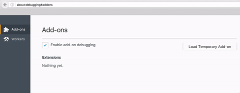
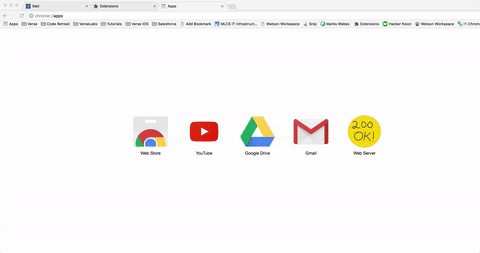

# {{page.title}}

This tutorial will get you started writing an application for Verse. There is much more detailed documentation available [here][16]{:target="_blank"}, but it's not required to complete the tutorials.

Structure of the Tutorial:

1. [Introduction](#introduction)
2. [Installing the Verse Developer Browser Extension](#installing-the-verse-developer-browser-extension)
3. [Add Action for Mail Compose](#add-action-for-mail-compose)
4. [Add Action for Mail Read](#add-action-for-mail-read)
5. [Secure the Application](#secure-the-application)
6. [Create a New Application Implementation](#create-a-new-application-implementation)

---

## 1. Introduction

### What is the Verse Developer browser extension?

The Verse Developer browser extension is a tool for developers who are adding customised capabilities to IBM Verse. The tool allows an application to be registered with IBM Verse, where each application contains a set of customised capabilities. One or more applications can be registered using the tool. Each application can contain one or more extensions. In this tutorial we will have a look at 2 of the possible types of extension points i.e. widget and templated link. To get a full list of the extension points supported by IBM Verse please go [here](../reference/reference.html#verse-extension-points).

1. [Widget](../reference/reference.html#widget-comibmverseextwidget) (type = com.ibm.verse.ext.widget)
2. [Templated Link](../reference/reference.html#templated-link-comibmappregexttemplatedlink) (type = com.ibm.appreg.ext.templatedLink)


As you will see in this tutorial extensions can be contributed to the following parts of the IBM Verse user interface:

* Business Card 
* Mail Compose View
* Mail Read View

### What you are going to build
This tutorial starts with a sample application for you to add functionality to the Business Card in Verse. Then you will write another application that adds functionality to both the Mail Compose and Mail Read views.

### What you'll learn
* How to add extensions into the Verse UI for your application.
* How to transfer data from Verse to your application.

### What you'll need
* Google Chrome or Firefox (minimum version 49.0) browser
* [Web Server for Chrome][1]{:target="_blank"} (alternatively, you can also use FireFox Thimble, or your own web server of choice)
* The Verse Developer Browser Extension source code
* A text editor
* Basic knowledge of HTML, CSS, JavaScript, and Chrome DevTools
* Estimated time: 40 min

This tutorial gets you started on building an application for Verse. It does not go into the details of the API and different concepts. If you want to learn more, you can refer to the [Further Reading](#further-reading) section at the end of the tutorial, but the readings are not required to finish this tutorial.

Note: The changes you make during the tutorial will only be applied to the Chrome browser that has the extension installed. To let other people test your Application, you will need to share the edited extension with them and let them install it on their Chrome browsers too. IBM will be providing an Application Registry to allow you to deploy your application in production.

---

## 2. Installing the Verse Developer browser extension
In this section, you will install the default Verse Developer browser extension and make it work with Verse. This Verse Developer browser extension already has one sample application, which contains one extension.

### Download source code for Verse Developer Extension
1. Download the Verse Developer Browser Extension source code to your local file system by clicking [here][8].

  Alternatively, you can fork the repository from [here][7]{:target="_blank"} instead of downloading it.

2. Extract the folder at a location convenient to you.

3. After you have extracted the folder, locate the `src` folder. In this tutorial, you will modify the `manifest.json` and `applications.json` files from within the `src` folder.

We have also provided a `tutorial_getting_started` folder which contains four subfolders: `step2`, `step3`, `step4`, and `step5`. These subfolders contain the completed version of the files modified in each step of this tutorial.

### Update manifest.json
In the `src/manifest.json` file there is a `matches` property, which contains an array of URLs. The extension will only run if the URL visited by the user matches one of the URLs listed in this array. 
If the Verse URL you are using is not listed in this array, update the `manifest.json` file to include it:

1. Open `src/manifest.json` file in a text editor.
2. See if the value for the property `matches` contains the URL you will be using for Verse. The `*` at the end of a URL means matching 0 or more characters. We recommend adding the `*`.
3. If your Verse URL is already there, proceed to the next step to install Verse Developer on either Google Chrome or Firefox. Otherwise, append the Verse URL you will be working with into the array as a string. __Don't forget to add a comma `,` at the end of the preceding URL before adding your own__.

In code snippet below shows the `manifest.json` edited to include the `https://mail.notes.collabservintegration.com/verse` Verse URL

```json
{
  "name": "IBM Verse Developer Browser Extension",
  "version": "1.0.0",
  "manifest_version": 2,
  "applications": { "gecko": {"id": "verse_dev_extension@ibm.com", "strict_min_version": "45.0"} },
  "content_scripts": [ {
    "js": [ "contentscript.js"],
    "matches": [
      "https://mail.notes.na.collabserv.com/verse*",
      "https://mail.notes.ap.collabserv.com/verse*",
      "https://mail.notes.ce.collabserv.com/verse*",
      "https://mail.notes.collabservintegration.com/verse*"
    ],
    "run_at": "document_start"
  }],
  "web_accessible_resources": [
    "page.js",
    "applications.json",
    "samples/templatedLink.html",
    "samples/actions.html",
    "custom-name-picker/index.html",
    "hook-before-send/index.html"
  ]
}
```

### Installing to Chrome
1. Open your Google Chrome browser, and type in the address bar: `chrome://extensions`.
2. Select __Developer mode__, (unpacked extensions can only be loaded in __Developer mode__.)  
3. Click the button __Load unpacked extension...__.  
4. In the pop-up file picker, select the `src` folder, which contains the `manifest.json` file.  
5. At this point, you should be able to see the IBM Verse Developer Browser Extension loaded into your `chrome://extensions` page.  


  If you received an error related to `Failed to load extension from: ... Manifest file is missing or unreadable`, make sure you are loading the extension from the `src` folder, not its parent folder.

### Installing to Firefox
1. Open your Firefox browser, and type in the address bar: `about:debugging`.
2. Select __Load Temporary Add-On__,
3. In the pop-up file picker, select the `manifest.json` file inside the `src` folder.
4. At this point, you should be able to see the IBM Verse Developer Browser Extension loaded into your `about:debugging` page.



### Reload Verse and test it out
1. __Reload Verse__, so that it will pick up the change you made to the extension.
2. Hover over a People bubble, and click on the __i__ icon to bring up the business card.
3. Click on the __arrow__ button located at the right bottom part of the business card to turn the card around.
4. At the back of the business card you will see a new link called __Person Action__.  
5. Click on the __Person Action__ link. This will load a web page in a popup window and display details of the messages that were sent from Verse to that page.


### How it works
If you have reached this step, congratulations! You successfully installed the Verse Developer Extension with one default application. But how does this all work?

An external application is registered with Verse via the file `applications.json`

```json
[
  {
    "id": "com.ibm.verse.sample.app.widget",
    "name": "Widget Samples",
    "title": "Widget Sampled",
    "description": "This samples demonstrates using the widget extension point",
    "extensions": [
      {
        "id": "com.ibm.verse.sample.ext.widget",
        "name": "Person Action Sample",
        "type": "com.ibm.verse.ext.widget",
        "payload": {
          "url": "${extensionPath}/samples/actions.html",
          "features": [
            "core"
          ],
          "actions": [
            {
              "id": "com.ibm.verse.ext.person.action",
              "object": "com.ibm.appreg.object.person",
              "text": "Person Action",
              "title": "Person Action",
              "location": "window",
              "renderParams": {
                "width": "900",
                "height": "500"
              }
            }
          ]
        }
      }
    ],
    "services": [
      "Verse"
    ]
  }
]
```

* The external application has `id`, `name`, `title` and `description` properties which are self explanatory.
* The external application also declares a single extension of type `com.ibm.verse.ext.widget` which is used to integrate a third party web application
* The web application location is specified in the `payload` object via the `url` property
* For this sample the web application is a simple page which listens for messages from Verse and displays them
* The web page is loaded from within the browser extension as a web accessible resource, hence the url beginning with `${extensionPath}`
* The web application must also send a `com.ibm.verse.application.loaded` message to Verse to signal that it has successfully loaded
* If the web application does not send a `com.ibm.verse.application.loaded` message to Verse within 30 seconds then Verse will display an error message to the user
* The extension declares one action which is bound to the `com.ibm.appreg.object.person` object, which means it displays on the back of all Verse business cards
* When this action is triggered it will open the associated web application in a new window which is 900 X 500 pixels in size
* The web application receives a message when the action is clicked with a context object which contains data about the person whose business card the action was triggered from

To learn more about context objects and how they get sent, please refer to __Verse API data__ and __Sending and receiving data from Verse__ in the [Further Reading](#further-reading) section at the end of the tutorial.

In the next section, you will learn how to add further actions to the mail compose and mail read parts of the Verse UI.

---

## 3. Add Action for Mail Compose
In this section, you will add a new action which appear in the toolbar displayed when composing a mail i.e. Mail Compose view. When the user clicks on this action, the same external application will be opened. This extension point is very useful in cases where you want to display information relevant to a mail a user is currently composing e.g. you could use it to trigger the Watson Tone Analyser to provide the user with data on the tone of the mail before they send it.


### Edit applications.json
1. Open `src/applications.json` in your text editor.

2. Append the following object into the `actions` array in `applications.json`, and save the file. __Don't forget to add a comma `,` at the end of the preceding action before adding this one__.

```json
            {
              "id": "com.ibm.verse.ext.mail.compose.action",
              "path": "mail.compose",
              "text": "Mail Compose Action",
              "title": "Mail Compose Action",
              "location": "window",
              "renderParams": {
                "width": "900",
                "height": "500"
              }
            }
```

Your file `applications.json` should now look like this:  

```json
[
  {
    "id": "com.ibm.verse.sample.app.widget",
    "name": "Widget Samples",
    "title": "Widget Sampled",
    "description": "This samples demonstrates using the widget extension point",
    "extensions": [
      {
        "id": "com.ibm.verse.sample.ext.widget",
        "name": "Person Action Sample",
        "type": "com.ibm.verse.ext.widget",
        "payload": {
          "url": "${extensionPath}/samples/actions.html",
          "features": [
            "core"
          ],
          "actions": [
            {
              "id": "com.ibm.verse.ext.person.action",
              "object": "com.ibm.appreg.object.person",
              "text": "Person Widget Action",
              "title": "Person Widget Action",
              "location": "window",
              "renderParams": {
                "width": "900",
                "height": "500"
              }
            },
            {
              "id": "com.ibm.verse.ext.mail.compose.action",
              "path": "mail.compose",
              "text": "Mail Compose Action",
              "title": "Mail Compose Action",
              "location": "window",
              "renderParams": {
                "width": "900",
                "height": "500"
              }
            }
          ]
        }
      }
    ],
    "services": [
      "Verse"
    ]
  }
]
```

### Reload the extension and Verse
__Every time__ you make a change to the extension code, you need to __reload the extension__ first, then __reload Verse,__ so that your browser and Verse will pick up your latest changes.

* To reload the extension in Chrome, open your Chrome browser, go to `chrome://extensions`, find the IBM Verse Developer Browser Extension, and click __Reload__.
* To reload the extension in Firefox, open your Firefox browser, go to `about:debugging`, find the IBM Verse Developer Browser Extension, and click __Reload__. Older versions of FireFox do not include the __Reload__ button so you may have to go to `about:addons`, remove the add-on and then go to `about:debugging` to reload it.

### Test it out
1. In the Verse UI, click the __Compose__ button.  
2. In the pop-up Mail Compose view, click on the __More actions__ button.  
3. In the drop-down menu, click __Mail Compose Action__. This will bring up the web application you just registered with the browser extension, with information related to the Mail Compose view passed on from Verse.  


Congratulations! You successfully added a button to the Mail Compose view, and registered the relevant application with Verse.


### How it works

* This action uses the `path` property to specify were it is displayed in the Verse UI
* Using `mail.compose` as the path will cause the action to be displayed in the toolbar in the mail compose window
* The action will also be available when replying to or forwarding a mail
* The action is always displayed in the overflow menu of the toolbar 

---

## 4. Add Action for Mail Read
In this section, you will add an action which will display when the user is reading a mail i.e. the Mail Read view. When the user clicks on this action, the same external application will be opened. This extension point is very useful for cases where you want to transfer received mails from Verse to another application e.g. you could use this to post a mail to Watson Workspace.


### Edit applications.json
1. Open `src/applications.json` in your text editor.

2. Append the mail read action object into the `com.ibm.verse.sample.ext.widget.mail.actions` extension belonging to the application with `id`: `com.ibm.verse.sample.app.widget`, and save the file. __Don't forget to add a comma `,` at the end of the preceding action object before adding your own__.


```json
            {
              "id": "com.ibm.verse.ext.mail.read.action",
              "path": "mail.read",
              "text": "Mail Read Action",
              "title": "Mail Read Action",
              "location": "window",
              "renderParams": {
                "width": "900",
                "height": "500"
              }
            }
```

Your file `applications.json` should look something like this:  

```json
[
  {
    "id": "com.ibm.verse.sample.app.widget",
    "name": "Widget Samples",
    "title": "Widget Sampled",
    "description": "This samples demonstrates using the widget extension point",
    "extensions": [
      {
        "id": "com.ibm.verse.sample.ext.widget",
        "name": "Person Action Sample",
        "type": "com.ibm.verse.ext.widget",
        "payload": {
          "url": "${extensionPath}/samples/actions.html",
          "features": [
            "core"
          ],
          "actions": [
            {
              "id": "com.ibm.verse.ext.person.action",
              "object": "com.ibm.appreg.object.person",
              "text": "Person Widget Action",
              "title": "Person Widget Action",
              "location": "window",
              "renderParams": {
                "width": "900",
                "height": "500"
              }
            },
            {
              "id": "com.ibm.verse.ext.mail.compose.action",
              "path": "mail.compose",
              "text": "Mail Compose Action",
              "title": "Mail Compose Action",
              "location": "window",
              "renderParams": {
                "width": "900",
                "height": "500"
              }
            },
            {
              "id": "com.ibm.verse.ext.mail.read.action",
              "path": "mail.read",
              "text": "Mail Read Action",
              "title": "Mail Read Action",
              "location": "window",
              "renderParams": {
                "width": "900",
                "height": "500"
              }
            }
          ]
        }
      }
    ],
    "services": [
      "Verse"
    ]
  }
]
```

### Reload the extension and Verse
As explained in previous sections, __every time__ you make a change to the extension code, you need to __reload the extension__ then __reload Verse,__ so that the browser and Verse will pick up your latest changes.  

* To reload the extension from Chrome go to `chrome://extensions`. 
* To reload from Firefox go to `about:debugging`


### Test it out
Now try it out in Verse: first __reload the extension and then reload Verse__ to pick up your latest code changes.
2. In the Mail Read view, click on the __More actions__ button.  
3. In the drop-down menu, click __Mail Read Action__. This will bring up the web application you just registered with the browser extension, with information related to the Mail Read view passed on from Verse.  


Congratulations! You successfully added an action button to the Mail Read view, and registered it as a new extension for the Mail Read application that you created in the last section.


### How it works

* This action also uses the `path` property to specify were it is displayed in the Verse UI
* Using `mail.read` as the path will cause the action to be displayed in the toolbar in the mail preview area
* The action is always displayed in the overflow menu of the toolbar 

---

## 5. Secure the Application
The sample applications we have worked with so far are not secure because they do no check the origin of messages they receive. 
It is your responsibility to protect your application against [cross-site scripting attacks][12]{:target="_blank"}.

The following version of the `actions.js` includes a check to verify the validity of the message origin. The method `isValidOrigin` contains a list of origins which the application expects to receive messages from. Messages from other origins are possible cross-site scripting attacks. This list of origins that are checked should be the same as the ones listed in the `manifest.json`.

```
/**
 * Print out Verse API data for all the action samples
 */
window.addEventListener("message", function(event) {
  if (!isValidOrigin(event.origin)) {
    return;
  }

  document.getElementById("status").innerHTML = "";

  var jsonNode = document.getElementById("json");
  jsonNode.innerText = jsonNode.innerText + "\n" + JSON.stringify(event.data, null, 2);

  /**
   * Message from Verse to check whether your web application is ready.
   */
  if (event.data.verseApiType === "com.ibm.verse.ping.application.loaded") {
    var loaded_message = {
      verseApiType: 'com.ibm.verse.application.loaded'
    };
    /**
     * Your application must send a message back to Verse
     * to identify that it's ready to receive data from Verse.
     */
    event.source.postMessage(loaded_message, event.origin);
  }
}, false);

/** 
 * Verify we are listening to the right origin
 * @param {String} currentOrigin - The url which we should listen to
 * @return {Boolean} true if the origin is valid, false otherwise
 */
function isValidOrigin(currentOrigin) {
  var originsList = [
    "https://mail.notes.na.collabserv.com",
    "https://mail.notes.ap.collabserv.com",
    "https://mail.notes.ce.collabserv.com"
  ];
  for (var i = 0; i < originsList.length; i++) {
    if (originsList[i].indexOf(currentOrigin) !== -1) {
      return true;
    }
  }
  return false;
}
```

---

## 6. Create a New Application Implementation
The previous sections showed you how to register an application with Verse, add a widget extension and then add multiple actions to the Verse UI. The external application that was launched was hosted within the Verse Developer Browser Extension. This is very convenient when developing a very simple page but a real application will need to be hosted elsewhere.

### Set up a web server
If you are familiar with setting up your own server for hosting web pages please add `src/samples/templatedLink.html` and `src/sample/templatedLink.js` to your server and then skip to the next step.

Otherwise, you can use the Chrome Web Server to set up a localhost on your machine by following these steps:

1. Install the Chrome Web Server from the [Chrome Web Store][1]{:target="_blank"} using your Chrome browser.
2. After installing, launch it by navigating to `chrome://apps` in your Chrome browser, and clicking on the icon for the Chrome Web Server:  
3. After the application is launched, click the __choose folder__ button and select the `src` folder of the Verse Developer Web Extension.  
4. Toggle the __Web Server: STARTED__ button to stop, then restart the web server. Once the server is started (indicated by a blue color on the button), you can access sample html files by clicking on the link provided under the __Web Server URL(s)__ section, or by typing that address into the browser.  



The web page you will use in this step is the templatedLink.html.

### Edit applications.json
For this step we are going to remove the application we worked on in the previous steps and add a new one. Edit the `applications.json` file so that it contains the following content:

```json
[
  {
    "id": "com.ibm.verse.sample.app.templatedlink",
    "name": "Templated Link Sample",
    "title": "Templated Link Sample",
    "description": "This samples demonstrates using the templated link extension point",
    "extensions": [
      {
        "id": "com.ibm.verse.sample.ext.templatedlink",
        "name": "Person Templated Link",
        "type": "com.ibm.appreg.ext.templatedLink",
        "object": "com.ibm.appreg.object.person",
        "payload": {
          "text": "Templated Link Action",
          "title": "Templated Link Action",
          "href": "http://127.0.0.1:8887/samples/templatedLink.html?searchFor=${profile.primaryEmail}"
        }
      }
    ],
    "services": [
      "Verse"
    ]
  }
]
```

### Test it out
1. Now try it out in Verse: first __reload the extension and then reload Verse__ to pick up your latest code changes.
2. Hover over a People bubble, and click on the __i__ icon to bring up the business card.
3. Click on the __arrow__ button located at the right bottom part of the business card to turn the card around.
4. At the back of the business card you will see a new link called __Person Templated Link__.  
5. Click on the __Person Templated Link__ link. This will load the associated web page in a new tab and will display the email address of the person whose business card was opened.


### How it works

* This step introduces a new extension point with the type `com.ibm.appreg.ext.templatedLink`
* A templated link is used to invoke a web application and data is passed is parameters in the URL query string
* Parameters are specified using the `${<parameter>}` notation where the `parameter` is a json path relative the the context data
* The location of the web application is specified using the `href` property
* If the protocol used by the web application is http or https then it is opened in a new browser tab, otherwise it is opened in a hidden iframe

---

## Further Reading
1. [Introduction to Verse extensibility][3]{:target="_blank"}
2. [Editing the `manifest.json` file][4]{:target="_blank"}
3. [Working with match patterns in `manifest.json`][2]{:target="_blank"}
4. [Verse API data][5]{:target="_blank"}
5. [Sending and receiving data from Verse][6]{:target="_blank"}
6. [Registering an application in IBM Verse][9]{:target="_blank"}
7. [Introduction to cross-document messaging][11]{:target="_blank"}
8. [Security implementation against cross-site scripting attack][12]{:target="_blank"}
9. [Tips for debugging][14]{:target="_blank"}


[1]: https://chrome.google.com/webstore/detail/web-server-for-chrome/ofhbbkphhbklhfoeikjpcbhemlocgigb
[2]: https://developer.chrome.com/extensions/match_patterns
[3]: ../reference/reference.html#introduction-to-ibm-verse-extensibility
[4]: ../reference/reference.html#editing-the-manifest
[5]: ../reference/reference.html#verse-api-data
[6]: ../reference/reference.html#sending-and-receiving-data
[7]: {{site.verse-developer-chrome-ext}}
[8]: {{site.verse-developer-chrome-ext}}/archive/master.zip
[9]: ../reference/reference.html#registering-an-application-in-ibm-verse
[11]: https://developer.mozilla.org/en-US/docs/Web/API/Window/postMessage
[12]: ../reference/reference.html#security
[14]:../reference/reference.html#troubleshooting
[15]:{{site.verse-developer-chrome-ext}}/blob/master/src/samples/templatedLink.html
[16]:../reference/reference.html
[17]:{{site.verse-developer-chrome-ext}}/blob/master/src/samples/templatedLink.js

