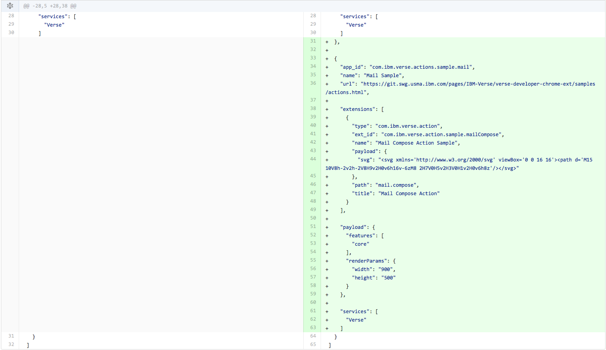
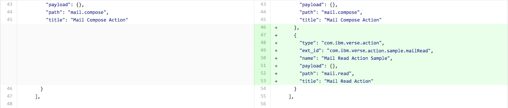

# {{page.title}}

This tutorial will get you started writing an Application for Verse. There is much more detailed documentation available [here][16], but it's not required to complete the tutorials.

Structure of the Tutorial:

1. [Introduction](#introduction)
2. [Installing the Verse Developer Extension for Google Chrome](#installing-the-verse-developer-extension-for-google-chrome)
3. [Add Action for Mail Compose](#add-action-for-mail-compose)
4. [Add Action for Mail Read](#add-action-for-mail-read)
5. [Create a New Application Implementation](#create-a-new-application-implementation)

---

## 1. Introduction

### What is the Verse Developer Extension for Google Chrome?

The Verse Developer Extension for Google Chrome is a tool for developers who are adding customised capabilities to IBM Verse. The tool allows an Application to be registered with IBM Verse, where each Application contains a set of customised capabilities. One or more Applications can be registered using the tool. Each Application can contain one or more Extensions. IBM Verse supports action Extensions which are displayed in IBM Verse as either a button or a link. Action Extensions can be contributed to the following parts of the IBM Verse user interface:

* Business Card (bizCard) View
* Mail Compose View
* Mail Read View

### What you are going to build
This tutorial starts with a sample Application for you to add functionality to the Business Card (bizCard) in Verse. Then you will write another Application which adds functionality to both the Mail Compose and Mail Read Views.

### What you'll learn
* How to add actions into the Verse UI for your Application.
* How to transfer data from Verse to your Application.

### What you'll need
* Chrome browser
* [Web Server for Chrome][1] (alternatively, you can also use FireFox Thimble, or your own web server of choice)
* The Verse Developer Chrome Extension source code
* A text editor
* Basic knowledge of HTML, CSS, JavaScript, and Chrome DevTools

This tutorial focuses on getting you started on building an Application for Verse. It does not go into the details of the API and different concepts. If you need to learn more, you can refer to the __Further reading__ section at the end of each step of the tutorial, but they are not required to finish this tutorial.

Beware that the changes you made during the tutorial will only be applied to the Chrome browser that has the extension installed. To let other people test your Application, you will need to share the edited extension with them and let them install it on their Chrome browsers too. IBM will be providing an Application Registry to allow you to deploy your Application in production.

---

## 2. Installing the Verse Developer Extension for Google Chrome
In this section, you will install the default Verse Developer Extension and make it work with Verse. This Verse Developer Extension already has one sample Application, which contains one Extension under it.

### Download source code for Verse Developer Extension
1. Download the Verse Developer Extension for Google Chrome source code to your local file system by clicking [here][8].

  Alternatively, you can fork the repository from [here][7] instead of downloading it.

2. Unzip the folder at a location convenient to you.

3. Once you have unzipped the folder, locate the `src` folder. In this tutorial, you will be modifying the `manifest.json` and `applications.json` files from within the `src` folder.

We have also provided a `tutorial` folder which contains three subfolders: `src-step2`, `src-step3` and `src-step4`. Each subfolder includes the completed version of the files modified in each step of the tutorial.

### Update manifest.json
In the `src/manifest.json` file there is a `matches` property which contains an array of URLs. The extension will only run if the URL visited by the user matches one of the URLs listed in this array. If the Verse URL you are using is not in this array, you will have to update the `manifest.json` file to include it.

1. Open `src/manifest.json` file in a text editor.

2. See if the value for the property `matches` contains the URL you will be using for Verse. The `*` at the end of a URL means matching 0 or more characters. We recommend adding the `*`.

3. If your Verse URL is already there, skip to the next step [Load unpacked extension](#load-unpacked-extensions). Otherwise, append the Verse URL you will be working with into the array as a string. __Don't forget to add a comma `,` at the end of the preceding URL before adding your own__.

  For example:  


### Load unpacked extensions
1. Open your Google Chrome browser, and type in the address bar: `chrome://extensions`.

2. Select __Developer mode__, (unpacked extension can only be loaded in __Developer mode__.)  


3. Click the button __Load unpacked extension...__.  


4. In the pop-up file picker, select the `src` folder, which contains the `manifest.json` file.  


5. At this point, you should be able to see the IBM Verse Developer Extension for Google Chrome loaded into your `chrome://extensions` page.  


  If you received an error related to `Failed to load extension from: ... Manifest file is missing or unreadable`, make sure you are loading the extension from the `src` folder, not its parent folder.


### Reload Verse and test it out
1. __Reload Verse__, so that it will pick up the change you made to the extension.

2. Hover over a People Bubble, and click on the __i__ icon to bring up the business card (bizCard).  


3. Click on the __arrow__ button located at the right bottom part of the bizCard to turn the bizCard around.  


4. At the back of the bizCard you will see a new button called __Person Action__.  


5. Click on the __Person Action__ button. This will load a web Application in a separate window, which uses information sent from the Verse bizCard.


### How it works
If you have reached this step, congratulations! You have successfully installed the Verse Developer Extension with one default Application, but how does this all work?

The external Application is registered via the file `applications.json`, which is under the `src` folder. This file is also responsible for adding the __Person Action__ button to the bizCard.

Open `src/applications.json` in a text editor. It contains an array of objects. Each object contains an Application, with one or more Extensions registered under it. The URL for the external Application is specified under the property `url`.

The URL contains the variable `profile.primaryEmail`, surrounded by a pair of angle brackets `<>`. The value for this variable will be calculated and automatically filled in when the external Application is loaded.

`profile.primaryEmail` is part of the *context* object for the bizCard that gets sent to the external Application from Verse. A context object contains information related to Verse. Each of the Extension points (bizCard, Mail Read View, and Mail Compose View), will have its own context structure.

To learn more about context object and how they get sent, please refer to __Verse API data__ and __Sending and receiving data from Verse__ in the [Further reading](#further-reading) section below.

For adding the UI button on the bizCard, we specified `person` as the value for the `object` property under `extensions`, and set its title to `"Person Action"` via the `title` property. In the next section, you will learn how to add UI buttons on different parts of the Verse UI.


### Further reading
1. [Introduction to Verse extensibility][3]
2. [Editing the `manifest.json` file][4]
3. [Working with match patterns in `manifest.json`][2]
4. [Verse API data][5]
5. [Sending and receiving data from Verse][6]

---

## 3. Add Action for Mail Compose
In this section, you will add a new Application which consists of one Extension to Verse. The Extension will add an action button to the Mail Compose View. When the user clicks on this button, an external Application will be opened in a separate window, and print out the details of the event data sent from Verse. In the next section, we will add a second Extension into this Application.


### Edit applications.json
1. Open `src/applications.json` in your text editor.

2. Append the following object into the array in `applications.json`, and save the file. __Don't forget to add a comma `,` at the end of the preceding Application before adding your own__.
  ```JavaScript
  {
    "app_id": "com.ibm.verse.actions.sample.mail",
    "name": "Mail Sample",
    "url": "{{site.baseurl}}/samples/actions.html",

    "extensions": [
      {
        "type": "com.ibm.verse.action",
        "ext_id": "com.ibm.verse.action.sample.mailCompose",
        "name": "Mail Compose Action Sample",
        "payload": {},
        "path": "mail.compose",
        "title": "Mail Compose Action"
      }
    ],

    "payload": {
      "features": [
        "core"
      ],
      "renderParams": {
        "width": "900",
        "height": "500"
      }
    },

    "services": [
      "Verse"
    ]
  }

  ```
If you are using Git, the before and after diffs for the file `applications.json` should look like this:  


### Reload the extension and Verse
__Every time__ you make a change to the extension code, you will have to __reload the extension__ first, then __reload Verse,__ so Chrome and Verse will pick up your latest changes.

To reload the extension, open your Chrome browser, go to `chrome://extensions`, find the IBM Verse Developer Extension for Google Chrome, and click __Reload__.  


### Test it out
1. In the Verse UI, click the __Compose__ button.  


2. In the pop-up Mail Compose View, click on the __More actions__ button.  


3. In the drop-down menu, click __Mail Compose Action__. This will bring up the web Application you just registered with the Chrome extension, with information related to the Mail Compose View passed on from Verse.  


Congratulations! You have successfully added an action button to the Mail Compose View, and registered the relevant Application with Verse.


### How it works
In this section, a new Application with its own `app_id` is added into `applications.json` and thus registered with Verse. Under this new app, we add an Extension with its own `ext_id`. It is also possible to add multiple Extensions within the same Application. We will give you an example in the next section.

You might have noticed that some of the properties in the newly added Application are quite different from the previous bizCard Application.

Under `extensions`, instead of using `object: "person"`, our new Application uses `path: "mail.compose"`. This indicates the action button should be located in the Mail Compose View. You might wonder, why would we use the key `object` in our previous example for bizCard, but `path` here for the Mail Compose View. The reason is, for this example, we are writing an Extension for a particular UI view (Mail Compose View), while in the previous Extension, instead of extending a particular UI view, we are actually extending the __Person__ object, which manifests in Verse as a bizCard, and you can open a bizCard from some other places apart from the People Bubble.

Under `payload`, we are still using `"features": ["core"]` to ask Verse to send context structure related to the Mail Compose View to the external Application via cross-document messaging.

### Further reading:
1. [Registering an application in IBM Verse][9]
2. [Sending and receiving data from Verse][6]
3. [Introduction to cross-document messaging][11]
4. [Verse API data][5]

---

## 4. Add Action for Mail Read
In this section, you will add an action button to the Mail Read View, which, when click, will bring out a separate window with information related to the Mail Read View sent from Verse. We will add this Extension into the Application we created in the last section which currently contains one Extension for the Mail Compose View.


### Edit applications.json
1. Open `src/applications.json` in your text editor.

2. Append the following object into the `extensions` belonging to the Application with `app_id`: `com.ibm.verse.actions.sample.mail`, and save the file. __Don't forget to add a comma `,` at the end of the preceding Extension before adding your own__.
  ```JavaScript
  {
    "type": "com.ibm.verse.action",
    "ext_id": "com.ibm.verse.action.sample.mailRead",
    "name": "Mail Read Action Sample",
    "payload": {},
    "path": "mail.read",
    "title": "Mail Read Action"
  }
  ```
If you are using Git, the diffs for the file `applications.json` before and after edit should show up as such:  


### Reload the extension and Verse
As explained in previous sections, __every time__ you make a change to the extension code, you need to __reload the extension__ from `chrome://extensions`, then __reload Verse,__ so Chrome and Verse will pick up your latest changes.


### Test it out
1. In the Verse UI, click on a mail to open it in the Mail Read View.

2. In the Mail Read View, click on the __More actions__ button.  


3. In the drop-down menu, click __Mail Read Action__. This will bring up the web Application you just registered with the Chrome extension, with information related to the Mail Read View passed on from Verse.  


Congratulations! You have successfully added an action button to the Mail Read View, and registered it as a new Extension for the Mail Read Application we created in the last section.


### How it works
In the previous section you learned how to add an Application containing one Extension to Verse by adding the new Application definition into the `applications` array in `applications.json`. In this section you learned how to add an additional Extension into this Application by adding the new Extension into the `extensions` array of the specific Application.

The configuration differences between the new Mail Read Extension and the Mail Compose Extension previously added are slight. For example, in the Mail Read Extension the `path` property is set to `mail.read` rather than `mail.compose`. This indicates the action button should be located in the Mail Read View.

---

## 5. Create a New Application Implementation
The previous sections have shown you how to register Applications with Verse, add one or more Extensions under each Application and add action buttons to the Verse UI.

To register these Applications, you were relying on a sample web page used in the `url` property element in `applications.json`. You will now implement your own web page.


### Create a web page
In this step you are going to create an HTML page, which will pop up when the user clicks on the action buttons previously added to Verse.

Create an empty folder on your laptop and create a file called `index.html` inside the folder.

Open `index.html` in a text editor, copy and paste our sample HTML code from [here][15] into the file and then save the file.

The web page shows details of the event sent from Verse to the Application for each of the action buttons added. In the case of the bizCard Extension, it will also print out the query arguments which were appended to the URL.


### Set up a web server
You will need a place to host the web page you just created.

If you are familiar with setting up your own server for hosting web pages, or prefer to use some alternative solutions such as FireFox Thimble, feel free to skip to the next step [Edit applications.json to point to your new URL](#edit-applications.json-to-point-to-your-new-url).

Otherwise, you can use the Chrome Web Server to set up a localhost on your machine by following these steps:

1. Install the Chrome Web Server from the [Chrome Web Store][1] using your Chrome browser.

2. After installing, you can launch it by navigating to `chrome://apps` in your Chrome browser, and click on the icon for the Chrome Web Server:  


3. After the Application is launched, click the __choose folder__ button and select the folder where you saved your `index.html` file.  


4. In the __options__ section, check the option "Automatically show index.html".  
  
This will allow you to use the Web Server URL shown in the section below without appending `/index.html` after the URL.

5. Toggle the __Web Server: STARTED__ button to stop, then restart the web server. Once the server is started (indicated by a blue color on the button), you can access index.html by clicking on the link provided under the __Web Server URL(s)__ section, or by typing that address yourself into the browser.  


  The web page you created will open in a separate window. As you are not accessing the page via Verse, you won't see any Verse API data at this point.  


### Edit applications.json to point to your new URL
Open `applications.json` in a text editor. Change the value for all the `url` properties to the address where your index.html page is hosted. If you were following our tutorial to use the Web Server for Chrome app to set up the server, this will be the value provided by the Application under the section __Web Server URL(s)__.


### Test it out
Now try it out in Verse: first __reload the extension and then reload Verse__ to pick up your latest code changes.

Try clicking the action buttons you added into Verse in previous steps, including the __Person Action__ button at the back of the bizCard, the __Mail Compose Action__ button in the Mail Compose View, and the __Mail Read Action__ in the Mail Read View. These actions will bring up in a separate window the web page you added in the previous section. It should be populated with some Verse API data now as the web Application is accessed via Verse.  


### How it works
When a user clicks on a new action button added to Verse via `applications.json`, Verse contacts your Application at the URL specified in the file and opens it in a new window. Once your Application is ready, Verse sends it the relevant data which is then displayed in your Application's window.

Now you have learned how to register your Application with Verse, add action buttons to the Verse UI, and get Verse send data to your Application, you can modify the sample HTML code we provided you in the previous section [Create web page](#create-web-page) to make your own Application for Verse!


### Further reading
[Tips for debugging][14]

---

## Documentation
Want to dig into the details? Here is a link to the documentation, for a comprehensive, structured reference to developing Applications for Verse:

[Documentation][16]


[1]: https://chrome.google.com/webstore/detail/web-server-for-chrome/ofhbbkphhbklhfoeikjpcbhemlocgigb
[8]: {{site.verse-developer-chrome-ext}}/archive/master.zip
[2]: https://developer.chrome.com/extensions/match_patterns
[3]: {{site.baseurl}}/reference/reference.html#introduction-to-ibm-verse-extensibility
[4]: {{site.baseurl}}/reference/reference.html#editing-the-manifest
[5]: {{site.baseurl}}/reference/reference.html#verse-api-data
[6]: {{site.baseurl}}/reference/reference.html#sending-and-receiving-data
[7]: {{site.verse-developer-chrome-ext}}

[9]: {{site.baseurl}}/reference/reference.html#registering-an-application-in-ibm-verse
[11]: https://developer.mozilla.org/en-US/docs/Web/API/Window/postMessage

[14]:{{site.baseurl}}/reference/reference.html#troubleshooting
[15]:{{site.verse-developer-chrome-ext}}/blob/gh-pages/samples/actions.html

[16]:{{site.baseurl}}/reference/reference.html
