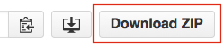

## 2. Installing Verse Developer Extension for Google Chrome

The default Verse Developer Extension already contains one sample application, with one extension under this application. In this section, you will install the Verse Developer Extension with this sample application and make it work with Verse.

### Download source code for Verse Developer Extension
Download the [Verse Developer Extension for Google Chrome][1] source code to your local file system by clicking the __Download Zip__ button:

Then unzip the folder at a location convenient to you.

Alternatively, you can fork the repository instead of downloading it.

### Update manifest.json
In the `manifest.json` file there is a `matches` property which contains an array of URL. The extension will only run if the URL visited by the user matches one of the URL listed in this array. So if the Verse URL you are currently using is not in this array, you will have to update the `manifest.json` file to include the Verse URL you'll be using.

To do so:

1. Open `src/manifest.json` file in a text editor.

2. See if the value for the property `matches` contains the URL you will be using for Verse. The `*` at the end of a URL means matching 0 or more characters.

3. If your Verse URL is already there, skip to the next step [Load unpacked extension](# load-unpacked-extensions). Otherwise, append the Verse URL you will be working with into the array as a string. Don't forget to add a comma `,` at the end of the preceding URL before adding your own! Here is an example:

### Load unpacked extensions
1. Open your Google Chrome browser, and type in the address bar: `chrome://extensions`.

2. Select __Developer mode__, as unpacked extension could only be loaded in __Developer mode__:

3. Click the button __Load unpacked extension...__:

4. In the pop-up file picker, select the `src` folder, which contains the `manifest.json` file:

5. At this point, you should be able to see the IBM Verse Developer Extension for Google Chrome loaded into your `chrome://extensions` page:

If you received an error related to `Failed to load extension from: ... Manifest file is missing or unreadable`, make sure you are loading the extension from the `src` folder, not its parent folder!

### Reload Verse and test it out
1. Open Verse in another tab in the Chrome browser. If you already have Verse open then please reload Verse. For Verse to pick up the extension you just installed, it is necessary to reload Verse.

2. Click on a People Bubble to bring up the business card (bizCard).

3. Click on the arrow button located at the right bottom part of the bizCard to turn the bizCard around:

4. At the back of the bizCard you will see a new button called __Person Action__:

5. Click on the button. This will load a web application in a separate window, which uses information sent from the Verse bizCard.

### How it works
If you have reached this step, congratulations! You have successfully installed the Verse Developer Extension with one default application, but how does this all work?

The external application is registered via the file `src/applications.json`, which also adds the button to the bizCard.

Open `src/applications.json` in a text editor, you will see that it contains an array of object. Each object contains an application, with one or more extensions registered under. The URL for the external application is specified under the property `url`.

You will notice that the URL contains a variable `profile.primaryEmail`, surrounded by a pair of angle brackets `<>`. `profile.primaryEmail` is part of the context structure for the bizCard that will get sent to the external application from Verse. The value for `profile.primaryEmail` will be calculated and automatically filled in when the external application is loaded. A context structure contains information related to Verse. For each of the extension points (bizCard, Mail Read View, and Mail Compose View), it will have its own context structure. To learn more about context structure and how they get sent, please refer to the [Further Readings](#further-readings) section.

For adding the UI button on the bizCard, we specified `person` as the value for the `object` property under `extensions`, and set its title to be `"Person Action"` via the `title` property. In the next section, you will learn how to add UI buttons on different parts of the Verse UI.

### Further readings
1. [Working with match patterns in `manifest.json`][2]
2. [Introduction to  Verse extensions][3]
3. [Introduction to Verse Developer Extension for Google Chrome][4]
4. [Context Structure in Verse][5]
5. [Sending data from Verse][6]

[1]: {{site.verse-developer-chrome-ext}}
[2]: https://developer.chrome.com/extensions/match_patterns
[3]: {{site.baseurl}}/tutorials/ext-intro.html
[4]: {{site.baseurl}}/tutorials/ext-widget-reg.html
[5]: {{site.baseurl}}/tutorials/context-structure.html
[6]: {{site.baseurl}}/tutorials/ext-send-data-to-app.html
