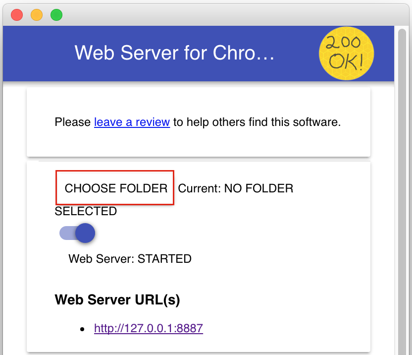
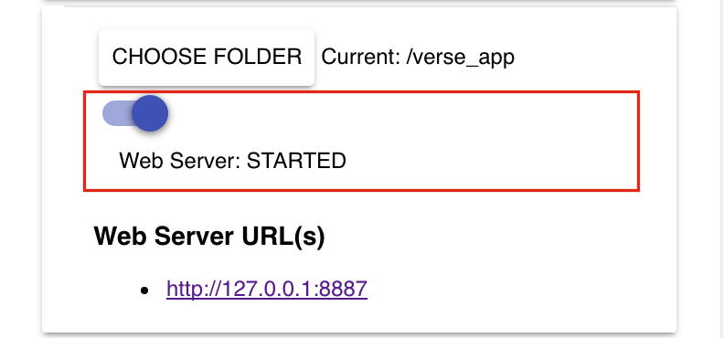

## 3. Create new application implementation

In previous sections, you have learned how to register applications with Verse, add one or more extensions under each application, and add action buttons to the Verse UI.

While registering those applications, in the `applications.json` file, we set the value of the `url` property to be the address of a sample web page we have set up for you. Now it is time for you to set up your own implementation.

### Create web page
In this step you are going to create an HTML page, which will pop up when the users click on the action buttons you added into Verse during the previous sections.

Create an empty folder on your laptop, then create a file called `index.html` inside the folder.

Open `index.html` in a text editor, copy and paste our sample HTML code from [here][3] into the file, then save.

The HTML will print out details of the event sent from Verse to the application for each of the action button added. If there is any error occurs, it will be printed out in the div on the top right corner of the page. In the case of the bizCard extension, it will also print out the query arguments appended to the URL.

### Set up a web server
You will need a place to host the web page you just created.

If you are familiar with setting up your own server for hosting web pages, or prefer to use some alternative solutions such as FireFox Thimble, feel free to skip to the next step [Edit applications.json to point to your new URL](#edit-widget.json-to-point-to-your-new-URL).

Otherwise, you can use the Chrome Web Server to set up a localhost on your machine by following these steps:

1. Install the Chrome Web Server from the [Chrome Web Store][1] using your Chrome browser.

2. After installing, you can launch it by navigating to `chrome://apps` in your Chrome browser, and click on the icon for the Chrome Web Server:  

3. After the app is launched, click the __choose folder__ button, select the folder where you put the `index.html` file you just made.  

4. In the __options__ section, check the option "Automatically show index.html".  
  
This will allow you to use the Web Server URL shown in the section below without appending `/index.html` after the URL.

5. Toggle the __Web Server: STARTED__ button to stop, then restart the web server. Once the server is started (indicated by a blue color on the button), you can access index.html by clicking on the link provided under the __Web Server URL(s)__ section, or by typing that address yourself into the browser. You shall see the web page you created in the previous step pops up in a separate window. There won't be much showing up on that page as you are not accessing it via Verse.  

### Edit applications.json to point to your new URL
Open `applications.json` in a text editor. Change the value for all the `url` properties to the address where your index.html page is hosted. If you were following our tutorial to use the Web Server for Chrome app to set up the server, this will be the value provided by the app under the section __Web Server URL(s)__.

### Test it out
Now try it out in Verse. Don't forget to reload the extension, then Verse to pick up your latest code changes!

Try clicking the action buttons you added into Verse in previous steps, including the __Person Action__ button at the back of the bizCard, the __Mail Compose Action__ button in the Mail Compose View, and the __Mail Read Action__ in the Mail Read View. These actions will bring up in a separate window the web page you added in the previous section [Create web page](#create-web-page) and hosted at the URL you specified in `applications.json`.

### How it works
When users click on the action buttons in Verse added via the `applications.json` file, Verse will open your application in a separate window, wait for your application to get ready, and send the relevant data to your application, which is hosted at the URL specified in `applications.json`.

Now you have learned how to register your application with Verse, add action buttons to the Verse UI, and get Verse send data to your application, you can modify the sample HTML code we provided you in the previous section [Create web page](#create-web-page) to make your own application for Verse!

### Further readings
[Tips for debugging][2]

[1]: https://chrome.google.com/webstore/detail/web-server-for-chrome/ofhbbkphhbklhfoeikjpcbhemlocgigb?hl=en
[2]:{{site.baseurl}}/tutorials/ext-debugging.html
[3]: https://git.swg.usma.ibm.com/raw/IBM-Verse/verse-developer-chrome-ext/gh-pages/samples/actions.html
