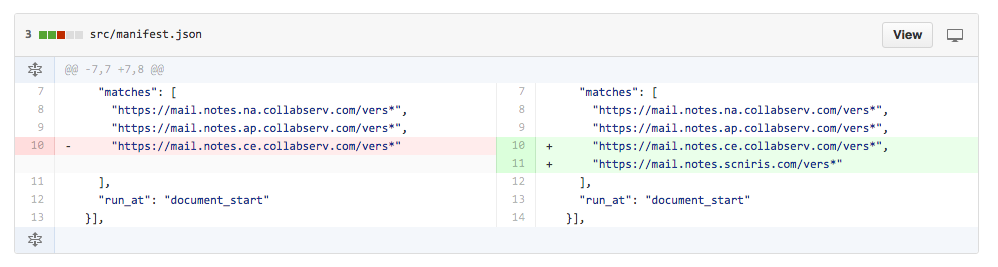
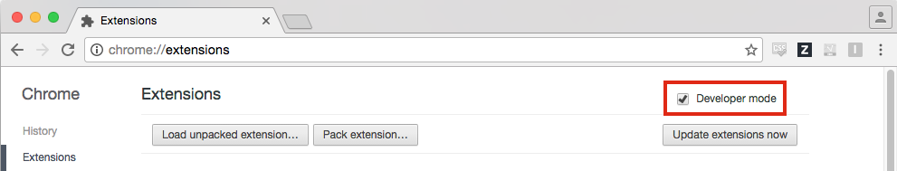
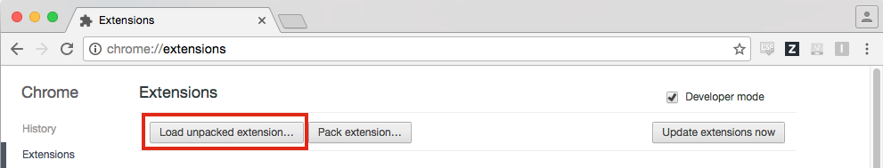
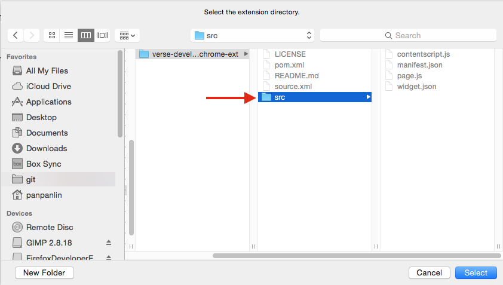
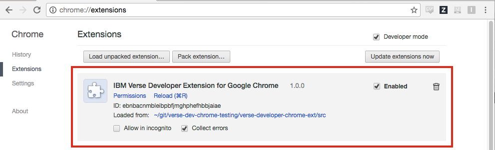
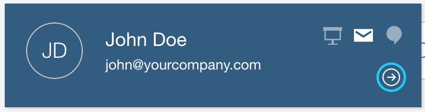
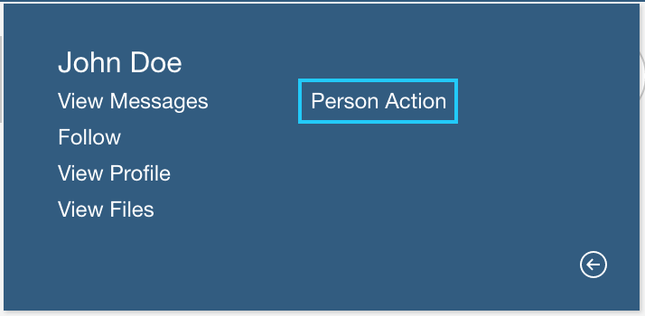
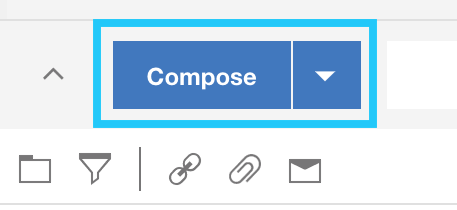
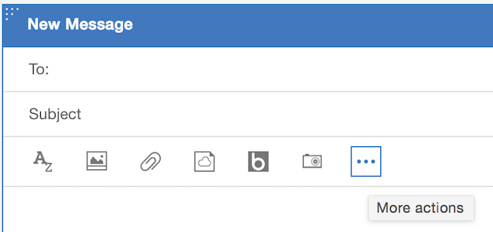
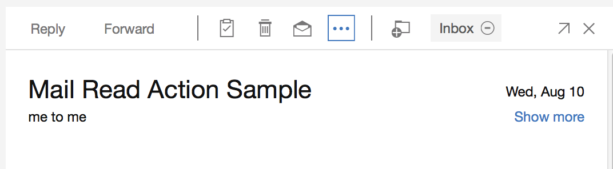

# Your First Application for Verse

This is a tutorial for getting started with writing an application for Verse. It is not a documentation. For the documentation, please click [here][16].

Structure of the Tutoria:

1. [Introduction](#1-introduction)
2. [Installing Verse Developer Extension for Google Chrome](#2-installing-verse-developer-extension-for-google-chrome)
3. [Add Mail Compose Action](#3-add-mail-compose-action)
4. [Add Mail Read Action](#4-add-mail-read-action)
5. [Create New Application Implementation](#5-create-new-application-implementation)
6. [Documentation](#6-documentation)

---

## 1. Introduction
### What is Verse Developer Extension for Google Chrome

Verse Developer Extension for Google Chrome allows you to extend Verse's functionality by sending data from Verse to your external application. You can have multiple applications registered within the Verse Developer Extension, each with their own `app_id`, and each of this application can have multiple Verse extensions, each with its own `ext_id`. The Verse Developer Extension currently supports adding UI buttons into the following parts in the Verse interface:
* Business Card (bizCard) View
* Mail Compose View
* Mail Read View

### What you are going to build
By following this tutorial, you are going to start with some pre-written sample code which adds functionality to the Business Card (bizCard) in Verse. You will then add another application for Verse which will add functionality to the Mail Compose View and the Mail Read View.

### What you'll learn
* How to add action buttons into the Verse UI for your application.
* How to transfer data from Verse to your application.

### What you'll need
* Chrome browser
* [Web Server for Chrome][1] (alternatively, you can also use FireFox Thimble, or your own web server of choice, including localhost)
* The Verse Developer Chrome Extension source code
* A text editor
* Basic knowledge of HTML, CSS, JavaScript, and Chrome DevTools

This tutorial focuses on getting you started on building an application for Verse. It does not go into the details of the API and different concepts. If you need to learn more, you can refer to the __Further Readings__ section at the end of each step of the tutorial, but they are not required to finish this tutorial.

Beware that the changes you made during the tutorial will only be applied to the Chrome browser that has the extension installed. To let other people use your application, you will need to share the edited extension with them and let them install it on their Chrome browsers too.

---

## 2. Installing Verse Developer Extension for Google Chrome
The default Verse Developer Extension already contains one sample application, with one extension under this application. In this section, you will install the Verse Developer Extension with this sample application and make it work with Verse.


### Download source code for Verse Developer Extension
Download the Verse Developer Extension for Google Chrome source code to your local file system by clicking [here][8].

Then unzip the folder at a location convenient to you.

Alternatively, you can fork the repository from [here][7] instead of downloading it.


### Update manifest.json
In the `manifest.json` file there is a `matches` property which contains an array of URLs. The extension will only run if the URL visited by the user matches one of the URLs listed in this array. So if the Verse URL you are currently using is not in this array, you will have to update the `manifest.json` file to include the Verse URL you'll be using.

To do so:

1. Open `src/manifest.json` file in a text editor.

2. See if the value for the property `matches` contains the URL you will be using for Verse. The `*` at the end of a URL means matching 0 or more characters. We recommend adding the `*`.

3. If your Verse URL is already there, skip to the next step [Load unpacked extension](# load-unpacked-extensions). Otherwise, append the Verse URL you will be working with into the array as a string. Don't forget to add a comma `,` at the end of the preceding URL before adding your own! Here is an example:  



### Load unpacked extensions
1. Open your Google Chrome browser, and type in the address bar: `chrome://extensions`.

2. Select __Developer mode__, as unpacked extension could only be loaded in __Developer mode__.  


3. Click the button __Load unpacked extension...__.  


4. In the pop-up file picker, select the `src` folder, which contains the `manifest.json` file.  


5. At this point, you should be able to see the IBM Verse Developer Extension for Google Chrome loaded into your `chrome://extensions` page.  


If you received an error related to `Failed to load extension from: ... Manifest file is missing or unreadable`, make sure you are loading the extension from the `src` folder, not its parent folder!


### Reload Verse and test it out
1. Open Verse in another tab in the Chrome browser. If you already have Verse open then please reload Verse, otherwise it will not be able to pick up the latest change you made to the extension.

2. Hover over a People Bubble, and click on the __i__ icon to bring up the business card (bizCard).  


3. Click on the __arrow__ button located at the right bottom part of the bizCard to turn the bizCard around.  


4. At the back of the bizCard you will see a new button called __Person Action__.  


5. Click on the __Person Action__ button. This will load a web application in a separate window, which uses information sent from the Verse bizCard.


### How it works
If you have reached this step, congratulations! You have successfully installed the Verse Developer Extension with one default application, but how does this all work?

The external application is registered via the file `applications.json`, which is under the `src` folder. This file is also responsible for adding the __Person Action__ button to the bizCard.

Open `src/applications.json` in a text editor. It contains an array of objects. Each object contains an application, with one or more extensions registered under. The URL for the external application is specified under the property `url`.

The URL contains a variable `profile.primaryEmail`, surrounded by a pair of angle brackets `<>`. `profile.primaryEmail` is part of the context structure for the bizCard that will get sent to the external application from Verse. The value for `profile.primaryEmail` will be calculated and automatically filled in when the external application is loaded. A context structure contains information related to Verse. For each of the extension points (bizCard, Mail Read View, and Mail Compose View), it will have its own context structure. To learn more about context structure and how they get sent, please refer to the __Further Readings__ section below.

For adding the UI button on the bizCard, we specified `person` as the value for the `object` property under `extensions`, and set its title to `"Person Action"` via the `title` property. In the next section, you will learn how to add UI buttons on different parts of the Verse UI.


### Further readings
1. [Working with match patterns in `manifest.json`][2]
2. [Introduction to  Verse extensions][3]
3. [Introduction to Verse Developer Extension for Google Chrome][4]
4. [Context Structure in Verse][5]
5. [Sending data from Verse][6]

---

## 3. Add Mail Compose Action
In this section, you will add a new application with one extension to `applications.json`. This extension will add an action button to the Mail Compose View, which, when clicked, will open your application in a separate window, which will print out all the context structure of the Mail Compose View provided by Verse. In the next section, we will add an extra extension into this application.


### Edit applications.json
1. Open `src/applications.json` in your text editor.

2. Append the following object into the array in `applications.json`, and save the file:
  ```JavaScript
  {
    "app_id": "com.ibm.verselabs.actions.sample.mail",
    "name": "Mail Sample",
    "url": "https://git.swg.usma.ibm.com/pages/IBM-Verse/verse-developer-chrome-ext/samples/actions.html",

    "extensions": [
      {
        "type": "com.ibm.verse.action",
        "ext_id": "com.ibm.verselabs.action.sample.mailCompose",
        "name": "Mail Compose Action Sample",
        "payload": {},
        "path": "mail.compose",
        "title": "Mail Compose Action"
      }
    ],

    "payload": {
      "features": [
        "core"
      ],
      "renderParams": {
        "width": "900",
        "height": "500"
      }
    },

    "services": [
      "Verse"
    ]
  }

  ```


### Reload the extension and Verse
Every time you make a change to the extension code, you will have to reload the extension first, then reload Verse, so Chrome and Verse will pick up your latest changes.

To reload the extension, open your Chrome browser, go to `chrome://extensions`, find the IBM Verse Developer Extension for Google Chrome, and click __Reload__.  


### Test it out
1. In the Verse UI, click the __Compose__ button.  


2. In the pop-up Mail Compose View, click on the __More actions__ button.  


3. In the drop-down menu, click __Mail Compose Action__. This will bring up the external application you just registered with the Chrome extension, with information related to the Mail Compose View passed on from Verse.  


Congratulations! You have successfully added an action button to the Mail Compose View, and registered the relevant application with Verse.


### How it works
In this section, a new application with its own `app_id` is added into `applications.json` and thus registered with Verse. Under this new app, we add an extension with its own `ext_id`. It is also possible to add multiple extensions within the same app. We will give you an example in the next section.

You might have noticed that some of the properties in the newly added application are quite different from the previous bizCard application.

Under `extensions`, instead of using `object: "person"`, our new application uses `path: "mail.compose"`. This indicates the action button should be located in the Mail Compose View. You might wonder, why would we use the key `object` in our previous example for bizCard, but `path` here for the Mail Compose View. The reason is, for this example, we are writing an extension for a particular UI view (Mail Compose View), while in the previous extension, instead of extending a particular UI view, we are actually extending the __Person__ object, which manifests in Verse as a bizCard, and you can open a bizCard from some other places apart from the People Bubble.

Under `payload`, we are still using `"features": ["core"]` to ask Verse to send context structure related to the Mail Compose View to the external application via cross-document messaging.

### Further readings:
1. [Working with the applications.json file][9]
2. [Sending data from Verse][10]
3. [Introduction to cross-document messaging][11]
4. [Context Structure in Verse][12]
5. [Adding multiple extensions][13]

---

## 4. Add Mail Read Action
In this section, you will add an action button to the Mail Read View, which, when click, will bring out a separate window with information related to the Mail Read View sent from Verse. We will add this extension into the application we created in the last section which currently contains one extension for the Mail Compose View.


### Edit applications.json
1. Open `src/applications.json` in your text editor.

2. Append the following object into the `extensions` belonging to the app with `app_id`: `com.ibm.verselabs.actions.sample.mail`, and save the file:
  ```JavaScript
  {
    "type": "com.ibm.verse.action",
    "ext_id": "com.ibm.verselabs.action.sample.mailRead",
    "name": "Mail Read Action Sample",
    "payload": {},
    "path": "mail.read",
    "title": "Mail Read Action"
  }
  ```


### Reload the extension and Verse
As is explained in previous sections, every time you make a change to the extension code, you need to reload the extension from `chrome://extensions__`, then reload Verse, so Chrome and Verse will pick up your latest changes.


### Test it out
1. In the Verse UI, click open a mail to inspect it in the Mail Read View.

2. In the Mail Read View, click on the __More actions__ button.  


3. In the drop-down menu, click __Mail Read Action__. This will bring up the external application you just registered with the Chrome extension, with information related to the Mail Read View passed on from Verse.  


Congratulations! You have successfully added an action button to the Mail Read View, and registered it as a new extension for the Mail Read application we created in the last section.


### How it works
In the last section, you have learned how to add a new app with a new extension to `applications.json`: You append the new app object into the array in `applications.json`. In this section, you have learned how to add multiple extensions into the same app registered with `applications.json`: you append the new extension into the `extensions` array of the specific app.

Configuration for the Mail Read extension you just added in the current section is quite similar to the Mail Compose extension you added in the previous section.

In the Mail Read extension, for the property `path`, instead of setting it to `mail.compose`, you are setting it to `mail.read`. This indicates the action button should be located in the Mail Read View.

---

## 5. Create New Application Implementation
In previous sections, you have learned how to register applications with Verse, add one or more extensions under each application, and add action buttons to the Verse UI.

While registering those applications, in the `applications.json` file, we set the value of the `url` property to be the address of a sample web page we have set up for you. Now it is time for you to set up your own implementation.


### Create web page
In this step you are going to create an HTML page, which will pop up when the users click on the action buttons you added into Verse during the previous sections.

Create an empty folder on your laptop, then create a file called `index.html` inside the folder.

Open `index.html` in a text editor, copy and paste our sample HTML code from [here][15] into the file, then save.

The HTML will print out details of the event sent from Verse to the application for each of the action button added. If there is any error occurs, it will be printed out in the div on the top right corner of the page. In the case of the bizCard extension, it will also print out the query arguments appended to the URL.


### Set up a web server
You will need a place to host the web page you just created.

If you are familiar with setting up your own server for hosting web pages, or prefer to use some alternative solutions such as FireFox Thimble, feel free to skip to the next step [Edit applications.json to point to your new URL](#edit-widget.json-to-point-to-your-new-URL).

Otherwise, you can use the Chrome Web Server to set up a localhost on your machine by following these steps:

1. Install the Chrome Web Server from the [Chrome Web Store][1] using your Chrome browser.

2. After installing, you can launch it by navigating to `chrome://apps` in your Chrome browser, and click on the icon for the Chrome Web Server:  


3. After the app is launched, click the __choose folder__ button, select the folder where you put the `index.html` file you just made.  


4. In the __options__ section, check the option "Automatically show index.html".  
  
This will allow you to use the Web Server URL shown in the section below without appending `/index.html` after the URL.

5. Toggle the __Web Server: STARTED__ button to stop, then restart the web server. Once the server is started (indicated by a blue color on the button), you can access index.html by clicking on the link provided under the __Web Server URL(s)__ section, or by typing that address yourself into the browser. You shall see the web page you created in the previous step pops up in a separate window. There won't be much showing up on that page as you are not accessing it via Verse.  


### Edit applications.json to point to your new URL
Open `applications.json` in a text editor. Change the value for all the `url` properties to the address where your index.html page is hosted. If you were following our tutorial to use the Web Server for Chrome app to set up the server, this will be the value provided by the app under the section __Web Server URL(s)__.


### Test it out
Now try it out in Verse. Don't forget to reload the extension, then Verse to pick up your latest code changes!

Try clicking the action buttons you added into Verse in previous steps, including the __Person Action__ button at the back of the bizCard, the __Mail Compose Action__ button in the Mail Compose View, and the __Mail Read Action__ in the Mail Read View. These actions will bring up in a separate window the web page you added in the previous section [Create web page](#create-web-page) and hosted at the URL you specified in `applications.json`.


### How it works
When users click on the action buttons in Verse added via the `applications.json` file, Verse will open your application in a separate window, wait for your application to get ready, and send the relevant data to your application, which is hosted at the URL specified in `applications.json`.

Now you have learned how to register your application with Verse, add action buttons to the Verse UI, and get Verse send data to your application, you can modify the sample HTML code we provided you in the previous section [Create web page](#create-web-page) to make your own application for Verse!


### Further readings
[Tips for debugging][14]

---

## 6. Documentation
Want to dig into the details? Here is a link to the documentation, for a comprehensive, structured reference to developing applications for Verse:

[Documentation][16]


[1]: https://chrome.google.com/webstore/detail/web-server-for-chrome/ofhbbkphhbklhfoeikjpcbhemlocgigb
[8]: https://git.swg.usma.ibm.com/IBM-Verse/verse-developer-chrome-ext/archive/master.zip
[2]: https://developer.chrome.com/extensions/match_patterns
[3]: {{site.baseurl}}/tutorials/ext-intro.html
[4]: {{site.baseurl}}/tutorials/ext-widget-reg.html
[5]: {{site.baseurl}}/tutorials/context-structure.html
[6]: {{site.baseurl}}/tutorials/ext-send-data-to-app.html
[7]: {{site.baseurl}}

[9]: {{site.baseurl}}/tutorials/ext-manifest.html
[10]: {{site.baseurl}}/tutorials/ext-send-data-to-app.html
[11]: https://developer.mozilla.org/en-US/docs/Web/API/Window/postMessage
[12]: {{site.baseurl}}/tutorials/context-structure.html
[13]: {{site.baseurl/tutorials/to_be_written.html}}

[14]:{{site.baseurl}}/tutorials/ext-debugging.html
[15]:https://git.swg.usma.ibm.com/raw/IBM-Verse/verse-developer-chrome-ext/gh-pages/samples/actions.html

[16]:https://git.swg.usma.ibm.com/pages/IBM-Verse/verse-developer-chrome-ext/
